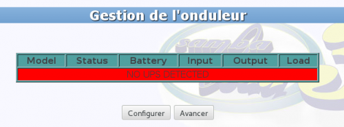

# L’interface graphique

Pour configurer l’onduleur, utilisez **l’interface web du se3** : 

- avec le module Configuration générale, rentrer dans le menu Onduleur :


- choisir ensuite votre onduleur grâce aux menus déroulants :


- vous devriez obtenir le résultat suivant ::smiley:


**Remarque** : dans cet article, on a pris comme exemple un onduleur smart-ups 750 ; si votre onduleur est différent, il faudra adapter les différentes commandes en conséquence.

# Cas d’un port usb

- **Tentez une configuration via l’interface web**
Si la tentative ci-dessus de configuration de l’onduleur, par l’intermédiaire de l’interface graphique, ne permet pas d’obtenir une configuration de l’onduleur…

→ dans le menu Onduleur, tout n’est pas au vert…



→ ou dans la page Diagnostic, le bouclier n’est pas au vert…


… **elle est tout de même indispensable** car la procédure ci-dessus a mis en place et configuré, bien que partiellement, des fichiers que nous n’aurons plus qu’à vérifier ou à modifier légèrement.

Pour compléter cette configuration, si cela est nécessaire (tout n’est pas au vert, y compris dans la page **Diagnostic**), nous allons utiliser la ligne de commande via un terminal en root sur le serveur se3.

Pour cela, **dans le cas d’un port usb**, nous vous proposons la procédure suivante.

- **Repérer des informations de l’onduleur**

À l’aide de la commande suivante : 
```
lsusb
```
