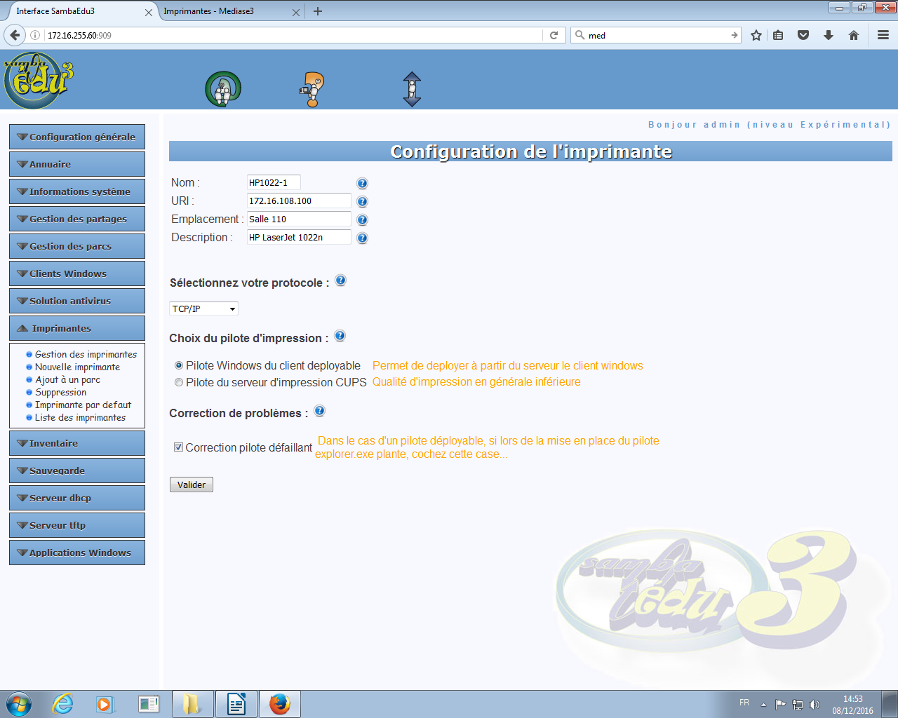

#Préambule

On se propose ici de décrire la mise en place d'une imprimante réseau sur un réseau SambaEdu

Serveur SambaEdu3 sous Wheezy
Clients windows 7 32 bits et 64 bits

Dans cet exemple et sur les copies d'écran, il s'agit d'une imprimante réseau HP Laserjet 1022n dont l'adresse IP est 172.16.108.100.

Pour l'ensemble des étapes qui suivent, on utilisera un poste sous Windows 4 64 bits, faisant partie du même parc que l'imprimante, et sur lequel on aura ouvert la session "admin".

#Trouver les drivers
La première étape consiste à télécharger les drivers sur le site du constructeur.

Pour ce modèle, on les trouvera ici : http://support.hp.com/fr-fr/drivers/selfservice/HP-LaserJet-1000-Printer-series/439424/model/439432

Le driver pour Windows 7 32 bits se nomme : lj1018_1020_1022-HB-pnp-win32-fr.exe

Le driver pour Windows 7 64 bits se nomme :
lj1018_1020_1022-HB-pnp-win64-fr.exe

Une fois téléchargés, il faut
Extraire le contenu avec par exemple 7-zip dans deux dossiers distincts.

#Sur le serveur
Sur le serveur, menu Imprimantes -> Nouvelle imprimante

#La console MMC

Ouvrir la console MMC en mmc.exe

##Activer la gestion des imprimantes