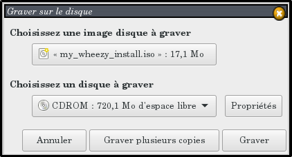
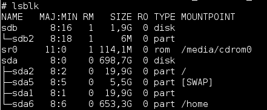
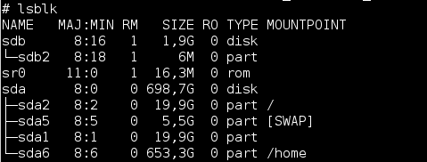
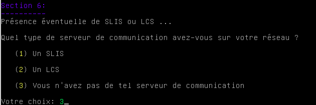

# Installation automatique d'un `Se3`

…article en chantier…

* [Préliminaires](#préliminaires)
    * [Objectif](#objectif)
    * [Installation semi-automatique](#installation-semi-automatique)
    * [Étapes de l'installation automatique d'un `se3`](#Étapes-de-linstallation-automatique-dun-se3)
    * [Vue d'ensemble des préparatifs](#vue-densemble-des-préparatifs)
* [Phase 1 : Les fichiers `preseed` et `setup_se3`](#phase-1--les-fichiers-preseed-et-setup_se3)
    * [Création des fichiers `preseed` et `setup_se3`](#création-des-fichiers-preseed-et-setup_se3)
    * [Téléchargement des fichiers](#téléchargement-des-fichiers)
    * [Utilisation du script `install_phase1.sh`](#utilisation-du-script-install_phase1sh)
    * [Les paramétres du script](#les-paramétres-du-script)
    * [Que fait le script **install_phase1.sh** ?](#que-fait-le-script-install_phase1sh-)
        * [Modification du fichier `preseed`](#modification-du-fichier-preseed)
        * [La méthode `file`](#la-méthode-file)
        * [La méthode `initrd`](#la-méthode-initrd)
* [Phase 2 : Utiliser l'archive d'installation personnalisée](#phase-2--utiliser-larchive-dinstallation-personnalisée)
    * [Test sur un réseau virtuel](#test-sur-un-réseau-virtuel)
    * [Graver sur un `CD`](#graver-sur-un-cd)
        * [En mode graphique](#en-mode-graphique)
        * [En ligne de commande, via un `terminal`](#en-ligne-de-commande-via-un-terminal)
    * [Copier sur une clé `usb`](#copier-sur-une-clé-usb)
    * [Utilisation de la clé `usb`, du `CD` , ou de l'image `iso`](#utilisation-de-la-clé-usb-du-cd-ou-de-limage-iso)
* [Phase 3 : connexion en `root` et installation du paquet `se3`](#phase-3--connexion-en-root-et-installation-du-paquet-se3)
* [Références](#références)


## Préliminaires


### Objectif

L'objectif est de créer un `CD` ou une clé `usb` d'installation complètement automatisée de son `se3 Wheezy`.

Ainsi, avec ce `CD` *personnalisé*, ou cette clé `usb`, et une sauvegarde de son `se3`, on pourra très rapidement (re)-mettre en production son `se3`, que ce soit sur la même machine ou sur une autre machine.

Pour la sauvegarde/restauration du `se3`, vous consulterez avec profit [la documentation ad hoc](../se3-sauvegarde/sauverestaure.md#sauvegarder-et-restaurer-un-serveur-se3).


### Installation semi-automatique

L'installation ne pourra pas se faire entièrement automatiquement dans les cas suivants :  
* installation sur plusieurs disques durs
* ré-installation en gardant les données des partitions `/home` et `/var/se3`

L'interface de création du fichier **se3.preseed** n'et prévu que pour 1 disque dur. Si vous avez plusieurs disques, une astuce consiste à créer le fichier **se3.preseed** via l'interface puis de supprimer la section concernant le partitionnement.

La conséquence est que l'installation ne sera plus totalement automatique puisque les questions concernant le partitionement vous seront posées au cours du processus ; une fois les réponses données pour le partitionnement des disques, le processus automatique reprendra.

Cette astuce sera aussi indispensable en cas de ré-installation en gardant les contenus des partitions `/home` et `/var/se3`.

Pour les détails concernant le partitionnement, reportez-vous à [la documentation de l'installation manuelle](installationmanuelle.md#partitionnement-des-disques).


### Étapes de l'installation automatique d'un `se3`

L'installation automatique d'un `se3` se déroule en 3 phases :

* **Phase 1 :** création des fichiers **se3.preseed** et **setup_se3.data** puis de l'archive personnalisée
* **Phase 2 :** installation du système d'exploitation `Debian` via l'archive personnalisée
* **Phase 3 :** installation du paquet **`se3` et consorts** et mise en place des mots de passe

Pour la description de chaque phase, vous consulterez [la documentation ad hoc](http://wwdeb.crdp.ac-caen.fr/mediase3/index.php/Installation_sous_Debian_Wheezy_en_mode_automatique).

Il s'agit, dans ce qui suit, de minimiser la manipulation des divers fichiers nécessaires lors de l'installation, en les incorporant, une fois pour toute, dans l'archive de l'installateur.

Ainsi, les 3 phases pourront s'enchaîner presque automatiquement.

>travail encore en chantier actuellement puisque nous sommes dans une phase de mise au point de ce projet d'automatisation.  
Les tests en machines virtuelles sont concluants ainsi que l'utilisation d'un `CD` sur une machine réelle.  
**Il reste à réaliser la même chose via une clé `usb`**.


### Vue d'ensemble des préparatifs

Lors de la phase 1 de l'installation classique sont créés les fichiers **se3.preseed** et **setup_se3.data** via l'interface de configuration.

Une fois cela effectué, on utilise le script **install_phase1.sh** pour obtenir une archive d'installation personalisée incorporant les 2 fichiers ci-dessus.

Deux méthodes sont décrites : la méthode "file" et la méthode "initrd". Le script utilise la méthode `initrd` qui a l'avantage de donner une archive pouvant être utilisée indifféremment via un `CD` ou via une clé `usb`.

Il suffit alors de démarrer une machine à partir d'un `CD` ou d'une clé `usb` contenant cette archive personnalisée pour que la phase 2 démarre et s'enchaîne sur la phase 3.


## Phase 1 : Les fichiers `preseed` et `setup_se3`

### Création des fichiers `preseed` et `setup_se3`

La phase 1 consiste à créer le fichier `preseed` (nommé ici **se3.preseed**) et le fichier **setup_se3.data** en utilisant [l'interface-outil de configuration](http://dimaker.tice.ac-caen.fr/dise3xp/se3conf-xp.php?dist=wheezy).

On pourra bien entendu utiliser un fichier **se3.preseed** existant, dans le cas d'une migration ou d'une ré-installation ou tout simplement par précaution : *mieux vaut prévenir que guérir*… Il y aura éventuellement des modifications à apporter en fonction des évolutions, que ce soit du point de vue des versions de `se3`, ou du point de vue du matériel, ou encore d'une optimisation des paramètres de ces fichiers.


### Téléchargement des fichiers

Une fois les fichiers **se3.preseed** et **setup_se3.data** ainsi créés, il s'agira de les télécharger en remplaçant les xxxx par le nombre qui convient (voir message de l'interface de création) :
```sh
wget http://dimaker.tice.ac-caen.fr/dise3wheezy/xxxx/{se3.preseed,setup_se3.data}
```

**Cas de l'installation semi-automatique :**  
Dans ce cas, il suffit de supprimer toutes les lignes du fichier **se3.preseed** qui concernent le partitionnement. Elles commencent à partir des lignes suivantes :
```ini
#Standart drive controler
# ----------------------------
```


### Utilisation du script `install_phase1.sh`

Le script **install_phase1.sh** permet d'incorporer les fichiers **se3.preseed** et **setup_se3.data** à une archive `iso` d'installation de `Debian/Wheezy`.

* Préparation  
Il suffit de placer le script et les 2 fichiers précédents dans un répertoire puis de télécharger le script dans ce répertoire.

* Téléchargez le script **install_phase1.sh**  
```sh
wget https://github.com/SambaEdu/se3-docs/raw/master/se3-installation/install_phase1.sh
```

* Passez en `root`  
Il faudra donner le mot de passe du compte root.
```sh
su
```

* Lancez le script  
par exemple avec le paramétre -m (si on veut utiliser une **mini.iso**)
```sh
bash install_phase1.sh -m
```

* Récupérez l'archive d'installation personnalisée **my_wheezy_install.iso**:  
Vous obtenez ainsi une archive personnalisée nommée **my_wheezy_install.iso**, ainsi que le fichier **se3.preseed.modif** pour informations des modifications apportées au fichier se3.preseed pour son incorporation.


### Les paramétres du script

Le script **install_phase1.sh** s'utilise avec un paramétre.
voici la liste des différentes possibilités pour ce paramétre :

**-h**  → aide-mémoire  
**-m**  → utilisation d'une mini.iso mais sans incorporation des firmwares  
**-mf** → utilisation d'une mini.iso et incorporation des firmwares  
**-n**  → utilisation d'une nestinst.iso mais sans incorporation des firmwares  
**-nf** → utilisation d'une nestinst.iso avec incorporation des firmwares  
**-i**  → utilisation d'une iso fournie dans le même répertoire que le script  
*indiquer le nom de l'iso en complément du paramétre -i*

Le mieux est de commencer par essayer une [ wheezy mini.iso](http://ftp.fr.debian.org/debian/dists/wheezy/main/installer-amd64/current/images/netboot/) (avec ou sans les firmwares non-free) ou une [debian-7.11.0-amd64-netinst.iso](http://cdimage.debian.org/cdimage/archive/7.11.0/amd64/iso-cd/) ou une [firmware-7.11.0-amd64-netinst.iso](http://cdimage.debian.org/cdimage/unofficial/non-free/cd-including-firmware/archive/7.11.0+nonfree/amd64/iso-cd/).

Pour ces deux archives netinst, le temps de téléchargement est important. C'est nettement plus rapide avec une mini.iso. Pour les firmwares à incorporer à la mini.iso, le temps de téléchargement est important aussi…

Cependant, certaines machines nécessitent un installateur non classique : il suffira de le télécharger (ou de le concevoir car je ne sais s'il en existe pour wheezy…) et de le placer dans le même répertoire que le script et les 2 fichiers. Ensuite, utilisez le paramétre -i suivi du nom de l'archive iso.


### Que fait le script **install_phase1.sh** ?

Ci-dessous, vous trouverez les détails qui vous permettront de comprendre ce que produit le script **install_phase1.sh** ; le script utilise la méthode `initrd` mais nous présentons d'abord la méthode `file`.


#### Modification du fichier `preseed`

Pour une automatisation complète, il est nécessaire de modifier certaines parties du fichier **se3.preseed** :

* On l'édite :
```sh
nano se3.preseed
```

…quelques lignes à modifier :

* **Pour la langue, le pays et les locales (paramètres régionaux)**  
Modifiez les lignes correspondant au **Language**, au **Pays** et aux **Choix des paramètres régionaux** en remplaçant ces 3 parties par la suivante :
```sh
# MODIFIER : langue, pays et parametres regionaux
# mettre en append → locale=fr_FR
d-i debian-installer/locale string fr_FR
```
>Attention : bugs dans le preseed de dimaker… partie des locales
>```sh
# Choix des parametres regionaux (locales)
d-i     debian-installer/locale                            string fr_FR.UTF-8
d-i     debian-installer/supported-locales                 string br_FR.UTF-8, en_US.UTF-8
d-i     debian-installer/locale                            string fr_FR.UTF-8
```
>Pourquoi une ligne est présente 2 fois ? Pourquoi il y a br au lieu de fr dans la ligne du milieu ?  
>→ ce doit être un bug : **outil de création du preseed à modifier ?**

* **Pour le clavier**  
Remplacez les lignes correspondant au **Clavier** (xkb-keymap, layoutcode et keymap) par la partie suivante :
```sh
# MODIFIER : clavier "azerty"
# mettre en append → keymap=fr(latin9)
d-i keymap select fr(latin9)
```

* **Un script inutile dans Network configuration**  
Commentez la ligne :
```sh
# MODIFIER :
# netcfg.sh n'est à utiliser que dans le cas d'une préconfiguration de type network (avec preseed/url)
#d-i preseed/run string netcfg.sh
```
>**NB :** il faudrait éclaircir cela. 
>Ce fichier existe nul part dans une install avec preseed d'un wheezy, il a surement été rajouté par ceux qui ont fabriqué l'install du se3. Lorsqu'on l'enlève, il semble qu'il n'y a pas d'accès reseau pendannt l'exécution du preseed mais elle réapparait après ; c'est pourquoi j'ai été obligé de télécharger les fichiers plus loin dans le preseed avant de faire l'install ; ceux-là : http://dimaker.tice.ac-caen.fr/dise3wheezy/se3scripts.  
>Lorsque je laisse cette ligne, l'installateur bloque avec un message rouge et me dit : le fichier netcfg.sh est corrompu…  
>[TODO] remettre les wget dans le preseed à la fin ? lorsque cette command fonctionnera , ce sera possible.  
>J'ai remarqué de grosses différences entre l'exécution de l'iso modifiée pour être complètement automatique (qui bloque sur netcfg.sh) et l'iso normale qui s'installe avec auto url=://dimaker… beaucoup de fichiers sont installés en plus dans la 2eme… entre autre netcfg et killall. Pourquoi ?

* **Pour les dépôts**  
Il faut ajouter ces lignes :
```sh
# AJOUTER : pour indiquer le miroir et eventuellement le proxy pour atteindre le miroir
# Mirror settings
d-i mirror/country string manual
d-i mirror/http/hostname string httpredir.debian.org
d-i mirror/http/directory string /debian
d-i mirror/suite string wheezy
d-i mirror/http/proxy string
```
>**NB :** pour le proxy ne faut-il pas mettre la ligne suivante ?
>```sh
d-i mirror/http/proxy string http://192.168.1.1:3128
```
>**NB :** il faudrait que l'outil de création du preseed soit modifié, non ?

* **Pour les statistiques**  
Une  ligne à rajouter :
```sh
# AJOUTER : pour eviter de répondre à la question
# Some versions of the installer can report back on what software you have
# installed, and what software you use. The default is not to report back,
# but sending reports helps the project determine what software is most
# popular and include it on CDs.
popularity-contest popularity-contest/participate boolean false
```
>**NB :** il faudrait que l'outil de création du preseed soit modifié, non ?

* **Pour la mise en place de la phase 3**  
modifiez les commandes à la fin :
```sh
# MODIFIER : 
# Preseed commands : mise en place de l'autologin
# ----------------
d-i preseed/early_command string cp /cdrom/setup_se3.data ./; \
    cp /cdrom/se3scripts/* ./; \
    chmod +x se3-early-command.sh se3-post-base-installer.sh install_phase2.sh; \
    ./se3-early-command.sh se3-post-base-installer.sh 
```
* **Vérification de conformité**  
Voila , le fichier **se3.preseed** est prêt.  
On peut tester sa conformité à l'aide de la commande suivante :
```sh
debconf-set-selections -c se3.preseed

```
>**NB** Il me répond cela :  
```sh
warning: Unknown type configuration, skipping line 42
warning: Unknown type AUTO, skipping line 51
warning: Unknown type AUTO, skipping line 56
warning: Unknown type AUTO, skipping line 59
warning: Unknown type AUTO, skipping line 61
warning: Unknown type AUTO, skipping line 62
warning: Unknown type bolean, skipping line 133
```
>Ça veut dire quoi ? Il y a un problème ?  
>→ pour les 6 premiers warning, non ; mais pour le dernier, oui : il faudrait boolean au lieu de bolean… Outil de création du preseed à modifier ? [TODO]

* **Modification facultative**  
Dans le fichier **se3.preseed**, le mot de passe du compte root du `se3` est en clair. Vous pouvez le crypter en utilisant la ligne commentée ci-dessous (si vous décommentez cette ligne, supprimez les 2 autres…) :
```sh
# Passwd super user
# -----------------
d-i passwd/make-user boolean false
d-i passwd/root-password password MOTDEPASSEROOT
d-i passwd/root-password-again password MOTDEPASSEROOT
#d-i passwd/root-password-crypted password $1$HMEw.SQy$Vwfh.sIK52ZXkAJcLtzQ71
```

Pour obtenir un mot de passe crypté à partir du mot de passe en clair
(mettons que ce soit MOTDEPASSEROOT), vous utiliserez la commande suivante :

```sh
printf "MOTDEPASSEROOT" | mkpasswd -s -m md5
```

Le résultat sera copié/collé à la place de celui en exemple ($1$HMEw.SQy$Vwfh.sIK52ZXkAJcLtzQ71).


#### La méthode `file`

* Préparation :  
On télécharge l'archive **se3scripts.tar.gz** qui contient les fichiers nécessaires pour la phase 3, en la décompressant dans un répertoire **se3scripts** :
```sh
wget https://github.com/SambaEdu/se3-docs/raw/master/se3-installation/se3scripts.tar.gz
tar -xzf se3scripts.tar.gz
```

>**NB :** certains des fichiers, contenus dans cette archive **se3scripts.tar.gz**, ont été modifiés à partir des fichiers disponibles à l'`url` http://dimaker.tice.ac-caen.fr/dise3wheezy/se3scripts. On a rajouté le fichier inittab qui est nécessaire pour la mise en place de l'autologin au début de la phase 3.


* Téléchargement de l'installateur `Debian` :  
Comme nous allons incorporer les fichiers d'installation `Wheezy`, créés précédemment, dans un `cd` ou une clé `usb`, il nous faut pour cela une archive `Debian Wheezy`.

Tout d'abord, récupérez une image d'installation de `Debian`. Une image *netinst* suffit (testée) :
```sh
wget http://cdimage.debian.org/cdimage/archive/7.11.0/amd64/iso-cd/debian-7.11.0-amd64-netinst.iso
```

Si votre serveur dispose de matériel (carte résau notamment) non reconnus car nécessitant des firmwares non libres, préférez cette image (testée) :
```sh
wget http://cdimage.debian.org/cdimage/unofficial/non-free/cd-including-firmware/archive/7.11.0+nonfree/amd64/iso-cd/firmware-7.11.0-amd64-netinst.iso
```

**NB :** on peut aussi incorporer les firmwares à l'archive comme cela est fait dans le script install_phase1.sh.

* Création des répertoires de travail **isoorig** et **isonew** :  
Pour mener à bien la modification de l'installateur `Debian`, on va créer deux répertoires :
* **isoorig :** il contiendra le contenu de l'image d'origine
* **isonew :** il contiendra le contenu de votre image personnalisée
```sh
mkdir isoorig isonew
```

* Du répertoire **isoorig** au répertoire **isonew**  
On monte, dans le répertoire **isoorig**, l'archive `iso` téléchargée , puis on copie son contenu dans le répertoire **isonew**.

→ Si vous utilisez l'archive **debian-7.11.0-amd64-netinst.iso** :
```sh
mount -o loop -t iso9660 debian-7.11.0-amd64-netinst.iso isoorig
rsync -a -H isoorig/ isonew
```

→ Si vous utilisez l'autre archive, **firmware-7.11.0-amd64-netinst.iso** :
```sh
mount -o loop -t iso9660 firmware-7.11.0-amd64-netinst.iso isoorig
rsync -a -H isoorig/ isonew
```

Cela dit que l'image est montée en lecture seule, c'est normal.

* Dans le répertoire **isonew**  
Les modifications suivantes seront à réaliser dans le répertoire **isonew**.

On va maintenant faire en sorte que l'installateur se charge automatiquement.

On donne les droits en écriture aux 3 fichiers à modifier :
```sh
chmod 755 ./isonew/isolinux/txt.cfg ./isonew/isolinux/isolinux.cfg ./isonew/isolinux/prompt.cfg
```
>**NB :** Est-ce nécessaire ? Si on est en root, non.

On modifie le fichier **isolinux/txt.cfg** pour l'utilisation du fichier `preseed` lors de l'installation (phase 2).

→ On l'édite :
```sh
nano ./isonew/isolinux/txt.cfg
```

→ On le modifie ainsi :
```sh
default install
label install
	menu label ^Install
	menu default
	kernel /install.amd/vmlinuz 
	append locale=fr_FR keymap=fr(latin9) file=/cdrom/se3.preseed initrd=/install.amd/initrd.gz -- quiet
```
**Remarque :** Veillez à adapter **install.amd/initrd.gz** selon l'architecture utilisée, ici `64bit`. En cas de doute, regardez ce qu'il y a dans le répertoire **isoorig**.

Ensuite, cela étant facultatif, éditez **isolinux/isolinux.cfg** :
```sh
nano ./isonew/isolinux/isolinux.cfg
```
changez *timeout 0* en *timeout 4* (par exemple)

…puis, tout aussi facultatif, éditez **isolinux/prompt.cfg** :

```sh
nano ./isonew/isolinux/prompt.cfg
```
changez *prompt 0* en *prompt 1*.

**NB :** ces deux opérations facultatives ont pour effet de lancer directement l'installation une fois le `CD` lancé. Cela peut éventuellement posé un problème lors du 1er redémarrage si le `CD` (ou la clé `usb`) n'est pas retiré.

→ On copie les 2 fichiers du `preseed` à la racine du répertoire **isonew** et le sous-répertoire **se3scripts** (voir ci-dessus pour son contenu) :
```sh
cp se3.preseed ./isonew/
cp setup_se3.data ./isonew/
mkdir ./isonew/se3scripts
cp ./se3scripts/* ./isonew/se3scripts/
```

→ Enfin, on reconstitue le fichier des sommes de contrôle (cela dépend en fait des installateurs utilisés) puis on crée la nouvelle image `iso` :
```sh
cd isonew
md5sum `find -H -type f` > md5sum.txt
```
>→ l'option -follow est obsolète ; il faudrait mettre -L (d'après man find), mais comme il y a un problème avec -L qui boucle de part un lien symbolique, on utilise -H (ne pas suivre les liens symboliques)

```sh
apt-get install genisoimage
genisoimage -o ../my_wheezy_install.iso -r -J -no-emul-boot -boot-load-size 4 -boot-info-table -b isolinux/isolinux.bin -c isolinux/boot.cat ../isonew
cd ..
```
L’image est là (dans le repertoire contenant isonew), elle porte le nom **my_wheezy_install.iso**.


#### La méthode `initrd`

L'archive de l'installateur `Debian` **debian-7.11.0-amd64-netinst.iso** (environ 220 Mo) permet d'utiliser la méthode `file` qui est décrite ci-dessus.

Si l'on veut utiliser une archive moins volumineuse, comme la **mini.iso** (environ 25 Mo), il est nécessaire d'utiliser la méthode `initrd`.

Dans cette méthode, au lieu de placer les fichiers à la racine de l'archive `iso`, on les place dans l'archive **initrd.gz** qui se trouve soit dans l'archive `iso` ou dans le répertoire *install.amd* de cette archive ; d'où le nom de cette méthode.

La plupart des actions détaillées ci-dessus sont à reprendre avec quelques différences que nous allons préciser.

* fichiers **se3.preseed** et **setup_se3.data**  
les modifications sont pratiquement identiques sauf pour la partie "Preseed commands". Voici les modifications à apporter :
```sh
# MODIFIÉ
# Preseed commands : mise en place de l'autologin
# ----------------
d-i preseed/early_command string cp se3scripts/* ./; \
    chmod +x se3-early-command.sh se3-post-base-installer.sh install_phase2.sh; \
    ./se3-early-command.sh se3-post-base-installer.sh 
```

* téléchargement des fichiers **pour la phase 3**  
on place ces fichiers dans un répertoire **se3scripts** comme indiqué ci-dessus.

* téléchargement de l'installateur **mini.iso**  
on prend une archive plus petite que la précédente,
que l'on renomme, par exemple, **wheezy_mini.iso** :
```sh
wget http://ftp.fr.debian.org/debian/dists/wheezy/main/installer-amd64/current/images/netboot/mini.iso -O wheezy_mini.iso
```

* création des répertoires **isoorig** et **isonew**  
comme ci-dessus; on monte l'archive **wheezy_mini.iso** dans le répertoire **isoorig** et on copie le contenu dans le répertoire **isonew**.
```sh
mkdir isoorig isonew
mount -o loop -t iso9660 wheezy_mini.iso isoorig
rsync -a -H isoorig/ isonew
```

* modification du fichier **txt.cfg**  
une différence notable avec la méthode précédente est la modification du fichier **txt.cfg** de l'archive `iso`.

On l'édite :
```sh
nano ./isonew/txt.cfg
```
On le modifie ainsi :
```sh
default install
label install
	menu label ^Install
	menu default
	kernel linux
	append locale=fr_FR keymap=fr(latin9) initrd=initrd.gz -- quiet
```
**Remarque :** on ne modifie pas les fichiers **isolinux.cfg** et **prompt.cfg**.

* incorporation à l'archive **intitrd.gz**  
on se place dans le répertoire **isonew**, on y crée un répertoire **temp** dans lequel on se place et décompresse l'archive **initrd.gz**.  
Ensuite, on y copie les fichiers nécessaires à l'installation, que ce soit pour la phase 2 ou la phase 3. Et, pour finir, on reconstitue l'archive **initrd.gz**.
```sh
mkdir temp
cd temp
gunzip -dc ../initrd.gz | cpio -id --no-absolute-filenames
cp ../../se3.preseed preseed.cfg
cp ../../setup_se3.data setup_se3.data
cp ../../se3scripts se3scripts
find . | cpio -o -H newc | gzip > ../initrd.gz
cd ..
rm -rf temp/
```

* incorporation des **firmwares** (non testée…)  
si on souhaite incorporer les firmwares à l'archive d'installation, voici comment procéder :  
dans le répertoire **isonews**, on télécharge le fichier **firmwares.cpio.gz** et on l'incorpore à l'archive **initrd.gz**.
```sh
cp -p initrd.gz initrd.gz.orig
wget http://cdimage.debian.org/cdimage/unofficial/non-free/firmware/wheezy/current/firmware.cpio.gz
cat initrd.gz.orig firmware.cpio.gz > initrd.gz
rm -f initrd.gz.orig firmware.cpio.gz
```

* reconstitution de **l'archive `iso`**  
enfin, on reconstitue l'archive `iso` pour obtenir une archive personnalisée.
```sh
genisoimage -o ../my_wheezy_install.iso -r -J -no-emul-boot -boot-load-size 4 -boot-info-table -b isolinux.bin -c boot.cat ../isonew
cd ..
```

Et voilà, vous avez une archive `iso` prête pour l'installation d'un `se3`.


## Phase 2 : Utiliser l'archive d'installation personnalisée


### Test sur un réseau virtuel

Sur une VM (Virtual Machine), il n'y a rien à faire de plus, on peut utiliser directement l'image `iso`.

D'ailleurs, nous vous conseillons de tester votre archive `iso` personnalisée sur une VM. Cela vous permettra de la valider.


### Graver sur un `CD`

#### En mode graphique

* Insérez un `CD` dans le lecteur de votre ordinateur  
Avec une taille supérieure à la taille de l'image `iso` (supérieure à 20 Mo ou à 300 Mo selon le cas)

* Cliquez-droit sur l'archive personnalisée **my_wheezy_install.iso**  
Dans le menu contextuel, choisir **Graver sur le disque…**  
Vous obtenez la fenêtre suivante :  


* Lancez la gravure du `CD`  
Cliquez sur **Graver**  
Une confirmation est demandée…  
  
Cliquez sur **Effacer le disque**

* Plusieurs étapes lors de la gravure  
Après l'effacement du disque, a lieu la gravure de l'archive `iso`, la fermeture du disque, la création d'une somme de contrôle et enfin l'éjection du disque gravé.

Le `CD` personnalisé d'installation de votre `se3` est prêt à être utilisé : [voir ci-dessous](#utilisation-de-la-clé-usb-du-cd-ou-de-limage-iso).


#### En ligne de commande, via un `terminal`

* Insérez un `CD` d'une taille supérieure à la taille de l'image `iso` (supérieur à 20 Mo ou à 300 Mo selon le cas).  

* Repérez l'identificateur du graveur  
```sh
lsblk
```
  

Ici, l'identificateur du graveur de `CD` est **/dev/sr0** et le `CD` est monté dans le répertoire **/media/cdrom0**.  
**NB :** Dans les commandes suivantes, remplacez *sr0* et */media/cdrom0* si ces indications sont différentes.

* Passez en `root` pour démonter le `CD` et vérifiez  
Il vous sera demandé le mot de passe root…
```sh
su
umount /media/cdrom0
lsblk
```
  

* Dans le cas où il est nécessaire d'effacer le `CD`  
```sh
wodim -v blank=fast dev=/dev/sr0
```

* Lancez la gravure du `CD`  
*…plus ou moins long selon la taille de l'archive `iso` à graver.*
```sh
wodim -v dev=/dev/sr0 -dao ./my_wheezy_install.iso
```

* Éjectez le `CD`  
```sh
wodim -eject
```

Le `CD` personnalisé d'installation de votre `se3` est prêt à être utilisé : [voir ci-dessous](#utilisation-de-la-clé-usb-du-cd-ou-de-limage-iso).


### Copier sur une clé `usb`

**Important :** dans la réalisation de l'archive `iso` ci-dessus, **si vous utilisez la méthode `file`** (le cas n'étant pas à envisager pour la méthode `initrd`), il faudra remplacer **cdrom** par **hd-media** si on veut l'utiliser via une clé `usb`. Non encore testé [TODO]. Il y a 3 occurrences à remplacer : 1 dans le fichier **txt.cfg**, ligne **append**, et 2 dans le fichier **se3.preseed**, dans la partie **# Preseed commands : mise en place de l'autologin**.

* Insérez votre clé `usb` d'une taille supérieure à la taille de l'image `iso` (supérieure à 20 Mo ou à 300 Mo selon le cas).

En root, tapez :
```sh
fdisk –l
```
Cela donne :
```sh
  Disk /dev/sdX: 3 GB, 3997486080 bytes 
  255 heads, 63 sectors/track, 486 cylinders 
  Units = cylinders of 16065 * 512 = 8225280 bytes 
 
     Device Boot      Start         End      Blocks   Id  System 
  /dev/sdX1   *           1         487     3911796    6  FAT1
```
* Repérez le volume /dev/sdX à coté de Disk qui correspond à votre clé `usb` grâce au système de fichier (`FAT 16` ou `FAT 32`) et à sa taille.

**Attention**, soyez certain de votre repérage. Si vous vous trompez de lettre, vous pouvez effacer un disque dur !  
**Important** dans la suite, remplacez X par la lettre qui convient pour la clé.

* Il est indispensable de démonter tous les points de montage de cette clé à l'aide de la commande umount puis lancez la copie :
```sh
umount /dev/sdX
cp ./my_wheezy_install.iso /dev/sdX && sync
```
* Vérifiez la copie :
```sh
mkdir /mnt/usb
mount /dev/sdX /mnt/usb
diff /mnt/usb/ ./isonew/
umount /dev/usb
```
La clé d'installation de votre se3 devrait être prête mais…

>Pour l'utilisation d'une clé usb, cela ne fonctionne pas

>En fait, cela n'est pas étonnant car les archives mini.iso ou netinst.iso disponibles sur le site de Debian ont une structure spéciale qui permet (j'imagine, mais y a-t-il d'autres raisons ?) que la clé ne prenne pas le nom sda à la place du disque dur de la machine.

>Lorsqu'on reconstitue l'archive iso via la commande geneisoimage, on perd cette structure et ensuite la clé n'est pas bootable quand on utilise un cp archive.iso /dev/sdb.

>Il faudrait voir s'il n'y a pas un paquet debian qui permettrait de reconstituer l'archive iso avec cette structure spéciale. Ou alors il faudrait comprendre comment obtenir cette structure spéciale… 


### Utilisation de la clé `usb`, du `CD`, ou de l'image `iso`

Le média (`CD` ou clé `usb`) étant connecté, la machine démarre sur ce média (paramétrez le `Bios` si besoin), il n'y a rien à faire, si ce n'est d'appuyer sur la touche `Entrée` au début :


L'installation est complètement automatique jusqu'à la première connexion en root : début de la phase 3.

**NB :** n'oubliez pas de retirer le `CD` ou la clé `usb` lors du 1er redémarrage, entre la phase 2 et la phase 3.


## Phase 3 : connexion en `root` et installation du paquet `se3`

**Remarque :** Il est dit [ici](http://wwdeb.crdp.ac-caen.fr/mediase3/index.php/FaqInstallnewserver#R.C3.A9cup.C3.A9ration_du_fichier_n.C3.A9cessaire_.C3.A0_l.27installation_du_nouveau_serveur) qu'il faut copier à ce moment le **secrets.tdb** en cas de migration mais ce n'est pas nécessaire. Le script **restaure_se3** s'occupe de tout.

Au redémarrage la connection en `root` est automatique (autologin) :

 - Il faut appuyer sur **Entrée**  


 - Choisir **3** s'il n'y a pas de serveur de communication, via un Amon par exemple


 - Saisir le mot de passe pour `adminse3`


 - Saisir le nouveau mot de passe pour le compte `root` du se3.
 

 - Confirmer le mot de passe…

 - Redémarrer le `se3` à la fin de la phase 3 :
```sh
reboot
```

Le `se3` est pret à être utilisé ou, selon le cas, restauré à partir d'une sauvegarde.


* Commentaires au sujet de l'utilisation de cette méthode d'installation d'un serveur se3 :

> on peut commenter un passage de install_phase2.sh pour que l'étape "appuyer sur la touche Entrée" soit éviter : est-ce souhaitable ?

> pour le choix du serveur de communication, peut-on rendre cela automatique à partir du **setup_se3.data** ? Il faudrait corriger ce truc, car il ne tient pas compte de la configuration initiale, non ?

> de même pour le mot de passe adminse3, c'est juste à la suite, comment l'éviter ? Est-ce souhaitable ?

>Il reste à tester que le `se3` est vraiment ok, en tout cas il est accessible via un navigateur [IPSE3]:909.

>On pourrait aussi rajouter les lignes suivantes, avant de terminer dans install_phase2.sh
```sh
apt-get --yes --force-yes se3-clamav se3-dhcp se3-clients-linux se3-wpkg se3-ocs se3-clonage se3-pla se3-radius
```
>Pour se3-backup il y a une intervention à faire en selectionnant apache2 puis ok, donc je ne sais pas si cela peut être complètement automatisé ?
```sh
apt-get --yes --force-yes se3-backup
```
>Puis finir par une mise à jour :
```sh
apt-get -qq update
apt-get upgrade --quiet --assume-yes
```

>**NB** Il faudrait essayer de terminer l'automatisation complète de la phase 3 dans l'objectif d'une restauration ?


## Références

Voici quelques références que nous avons utilisé pour la rédaction de cette documentation :
* Article du site [`Debian Facile`](https://debian-facile.org) : [preseed debian](https://debian-facile.org/doc:install:preseed) qui décrit l'incorporation d'un fichier `preseed`.
* Article du site [`Debian Facile`](https://debian-facile.org) : [graver une cle usb](https://debian-facile.org/doc:install:usb-boot) qui décrit la copie d'une image `iso` sur une cle `usb`.
* Article du site [`Debian Facile`](https://debian-facile.org) : [graver un cd](https://debian-facile.org/doc:systeme:wodim) qui décrit la copie d'une image `iso` sur un `CD`.
* La documentation officielle `Debian` concernant [l'installation via un preseed](https://www.debian.org/releases/wheezy/amd64/apb.html.fr).
* Un article sur [la modification de l'initrd](http://connect.ed-diamond.com/GNU-Linux-Magazine/GLMFHS-045/Une-installation-de-Debian-automatique).
* La documentation pour [incorporer des firmwares](https://wiki.debian.org/fr/DebianInstaller/NetbootFirmware#Exemples_pour_Debian_7_.22Wheezy.22).

