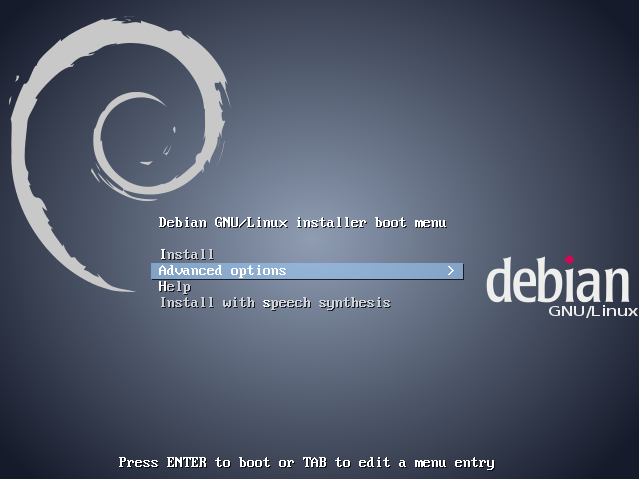
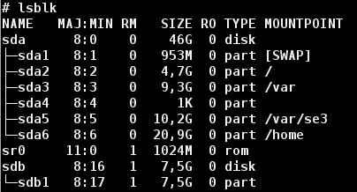

# Installation manuelle d'un `Se3`

* [Préliminaire](#préliminaire)
* [Fichier d'installation par le réseau](#fichier-dinstallation-par-le-réseau)
* [Lancement de l'installation de `Debian` (Phase 1)](#lancement-de-linstallation-de-debian-phase-1)
    * [Langue, pays, clavier](#langue-pays-clavier)
    * [Le réseau](#le-réseau)
    * [Les utilisateurs et mots de passe](#les-utilisateurs-et-mots-de-passe)
    * [Le serveur de temps](#le-serveur-de-temps)
    * [Partitionnement des disques](#partitionnement-des-disques)
    * [Installation du système de base](#installation-du-système-de-base)
    * [Outil de gestion des paquets (APT)](#outil-de-gestion-des-paquets-apt)
    * [Choisir et installer des logiciels](#choisir-et-installer-des-logiciels)
    * [Programme de démarrage `GRUB`](#programme-de-démarrage-grub)
    * [Fin de l'installation](#fin-de-linstallation)
* [Installation des paquets `Se3` (Phase 2)](#installation-des-paquets-se3-phase-2)
    * [Transfert des fichiers de la phase 2](#transfert-des-fichiers-de-la-phase-2)
    * [Lancement du script `install_phase2.sh`](#lancement-du-script-install_phase2.sh)


## Préliminaire

Un certain nombre de paramètres doivent être préparés avant de se lancer dans l'installation.

Voici ceux qui ont été pris pour la rédaction de cette documentation :

* l'ip du se3 : 192.168.0.60
* le masque de sous-réseau : 255.255.255.0
* l'ip de la passerelle : 192.168.0.1
* le nom du se3 : se3test
* le nom du domaine : local
* le serveur de noms : 192.168.0.1
* le mot de passe root du se3

vous les adapterez à votre situation et à votre plan d'adressage. Il est impératif que ces paramètres soient ceux du fichier **setup_se3.data** qu'il faudra créer par ailleurs (voir la documentation générale).

Dans l'installation présentée, un disque d'environ 50 Go, nommé **sda**, est utilisé.

En production, il faudra adapter les valeurs en fonctions de la place disponible et du nombre de disques durs de votre serveur.

Typiquement, on peut avoir 2 disques durs de 500 Go (nommés **sda** et **sdb**) que l'on pourra formater comme cela :
```sh
sda ---+-- swap (PRIMAIRE) 2 à 4 Go (Selon Mémoire)
       |
       +-- / (PRIMAIRE) ext3 30 Go
       |
       +-- /var (PRIMAIRE) ext3 20 Go
       |
       +-- /var/se3 (LOGIQUE) xfs (Go = Le reste)

sdb ------ /home (PRIMAIRE) xfs 500 Go
```

**Conseil :** n'hésitez pas à reprendre plusieurs fois l'installation pour bien la connaître. Par la suite, vous n'en aurez pas autant l'occasion.


## Fichier d'installation par le réseau

Le fichier d'installation est à télécharger et à graver sur un CD.

Vous trouverez ce fichier sur le site `Debian`.


## Lancement de l'installation de `Debian` (Phase 1)

Démarrer le serveur en insérant le CD sur lequel se trouve l'archive d'installation gravée.


Dans l'interface qui apparaît à l'écran, choisir **Advanced options** puis **expert instal**.


Ce mode d'installation présente toutes les questions qu'il est possible de poser. Cela vous permettra de gérer plus finement certaines étapes de l'installation.

Dans ce qui suit, la plupart du temps, il suffira d'appuyer sur la touche `Entrée` pour accepter l'option proposée par défaut (Continuer).

Le menu principal indique les principales étapes :


### Langue, pays, clavier

* la langue (Choose language) : **Français**
* le pays (situation géographique) : **France**
* les paramètres régionaux (locales) : **fr\_FR.UTF-8**
* paramètres supplémentaires : `Entrée`
* le clavier : **Français**


### Le réseau

* Détecter le matériel réseau (module usb-storage) : `Entrée`
* Configurer le réseau
    * Faut-il configurer le réseau automatiquement : Non
    * Donnez l'adresse `IP` du serveur : **192.168.0.60**
    * Valeur du masque-réseau (**255.255.255.0**) : `Entrée`
    * Passerelle (**192.168.0.1**) : `Entrée`
    * Serveur de noms (**192.168.0.1**) : `Entrée`


Un récapitulatif est affiché. Si c'est bon, il suffit de Choisir `Oui` ; pour modifier un des paramètres du réseau, choisir `Non`.

* Un délai de détection du réseau est proposé : `Entrée`
* Nom de machine : **se3test**

* Domaine : **local**
* Choix d'un miroir de l'archive `Debian`
    * protocole de téléchargements (**http**) : `Entrée`
    * pays du miroir (**France**) : `Entrée`
    * miroir de l'archive Debian (**ftp.fr.debian.org**) : `Entrée`
    * mandataire http (à laiser vide) : `Entrée`
    * version de Debian à installer (**wheezy - ancienne version stable**) : `Entrée`
* Télécharger des composants d'installation : `Entrée`


**Remarque :** dans cette partie, il se peut que l'on vous demande un pilote spécifique pour la carte réseau du `se3`. Cela peut se paramétrer une fois l'installation terminée. Cependant, si vous avez récupéré [les fichiers des firmwares](http://cdimage.debian.org/cdimage/unofficial/non-free/firmware/wheezy/current/) sur une clé `usb`, vous pouvez fournir le pilote concerné en suivant les indications données par l'installateur. Si le pilote n'est pas présent dans les fimwares, notez bien les indications affichées pour résoudre le prblème ultérieurement.


### Les utilisateurs et mots de passe

Un seul utilisateur suffit, il s'agit du compte **root** du `se3`.

* Activer les mots de passe cachés (Oui) : `Entrée`
* Autoriser les connexions du super utilisateur (Oui) : `Entrée`
* mot de passe du superutilisateur root : **à compléter**
* confirmer le mot de passe root
* compte utilisateur ordinaire : **Non**


### Le serveur de temps

On peut profiter du serveur de temps de la passerelle, que ce soit un `Amon` ou un `Slis`.

* utiliser NTP : **Oui**
* serveur ntp : **192.168.0.1**
* fuseau horaire : **Europe/Paris**


### Partitionnement des disques

* Détecter les disques
* Partitionner les disques
* Méthode de partitionnement : **Manuel**

* Choisir le disque sda

* Créer une nouvelle table des partitions : **Oui**
* Type de la table des partitions : **msdos**
* Paramétrage de la 1ère partition
    * Se positionner sur l'espace libre du disque sda
    
    * Créer une nouvelle partition
    * Nouvelle taile de la partition : **1 GB**
    * Type de la nouvelle partition : **Primaire**
    * Emplacement : début
    * Utiliser comme : avec la touche `Entrée`, choisir espace d'échange (swap)
    
    * Fin du paramétrage de cette partition
* Paramétrage de la 2ème partition
    * Se positionner sur l'espace libre du disque sda + `Entrée`
    * Créer une nouvelle partition
    * Nouvelle taile de la partition : **5 GB**
    * Type de la nouvelle partition : **Primaire**
    * Emplacement : début
    * Utiliser comme : avec la touche `Entrée`, choisir le système **ext3**
    * Formater la partition : **Oui, formater**
    * point de montage : **/**
    * indicateur d'amorçage : avec la touche `Entrée`, choisir présent
    
    * Fin du paramétrage de cette partition
* Paramétrage de la 3ème partition
    * Se positionner sur l'espace libre du disque sda
    * Créer une nouvelle partition
    * Nouvelle taile de la partition : **10 GB**
    * Type de la nouvelle partition : **Primaire**
    * Emplacement : début
    * Utiliser comme : avec la touche `Entrée`, choisir le système **ext3**
    * Formater la partition : **Oui, formater**
    * point de montage : **/var**
    * Fin du paramétrage de cette partition
* Paramétrage de la 4ème partition
    * Se positionner sur l'espace libre du disque sda
    * Créer une nouvelle partition
    * Nouvelle taile de la partition : **11 GB**
    * Type de la nouvelle partition : **Logique**
    * Emplacement : début
    * Utiliser comme : avec la touche `Entrée`, choisir le système **XFS**
    * Formater la partition : **Oui, formater**
    * point de montage : **/var/se3** il faudra utiliser **Autre choix** dans la liste des noms de partitions proposées
    * Fin du paramétrage de cette partition
* Paramétrage de la 5ème partition
    * Se positionner sur l'espace libre du disque sda
    * Créer une nouvelle partition
    * Nouvelle taile de la partition : accepter la valeur proposée (le reste disponible)
    * Type de la nouvelle partition : **Logique**
    * Emplacement : début
    * Utiliser comme : avec la touche `Entrée`, choisir le système **XFS**
    * point de montage : **/home**
    * Fin du paramétrage de cette partition

* Terminer le partitionnemnt et appliquer le changement : `Entrée`

* Faut-il appliquer les changements sur les disques : **Oui**


### Installation du système de base

Dans cette partie, il suffira de prendre les paramètres proposés par défaut.

* Installer le système de base : `Entrée`
* Noyau à installer (linux-image-amd64) : `Entrée`
* Pilotes à inclure (image générique) : `Entrée`


### Outil de gestion des paquets (APT)

Dans cette partie, il suffira de prendre les paramètres proposés par défaut.

* Configurer l'outil de gestion des paquets : `Entrée`
* Utiliser des logiciels non libres : **Non**
* Utiliser des logiciels contrib : **Non**
* services (sécurité et publication) : accepter les paramètres proposés `Entrée`


### Choisir et installer des logiciels

* Choisir et installer des logiciels : `Entrée`
* Étude statistique d'utilisation des paquets : **Non**
* droits programmes `man` et `mandb` : **Non**
* Logiciels à installer : (cocher/décocher à l'aide de la barre d'espace)
    * décocher l'environnement de Bureau `Debian`
    * décocher le serveur d'impression
    * cocher le serveur `SSH`


### Programme de démarrage `GRUB`

* Installer GRUB : `Entrée`
* Installer GRUB sur le secteur d'amorçage : **Oui**


### Fin de l'installation

* Terminer l'installation : `Entrée`
* heure universelle (UTC) : **Oui**
* **Retirer le CD** puis `Entrée`

Le système redémarre…


## Installation des paquets `se3` (Phase 2)

### Le fichier setup_se3.data

La seconde phase est chargée de l'installation des paquets spécifiques au serveur `se3`.

Pour cela, il faudra fournir au serveur le fichier **setup_se3.data** (à mettre dans une clé usb) et le script **install_phase2.sh** (à récupérer via le réseau).

* se connecter en **root** via `ssh` sur le serveur
* brancher la clé `usb`

* repérer le nom de la clé `usb`
Cela peut se faire à l'aide de la commande suivante :
```sh
lsblk
```

Vous pouvez repérer le nom attribué à la clé `usb` : dans la copie d'écran ci-dessus, **sda** est le disque dur sur lequel a été installé le système de base (les différentes partitions créées sont bien visibles) et **sdb** est le nom de la clé `usb` branchée.

* monter la clé `usb` et vérifier la présence du fichier setup_se3.data
```sh
mount /dev/sdc1 /mnt
ls -l /mnt
```

* créer le répertoire `/etc/se3` et copier le script `install_phase2.sh`
```sh
mkdir /etc/se3
cp /mnt/setup_se3.data /etc/se3
ls -l /etc/se3
```


### Le script install_phase2.sh

Toujours avec la session en **root** via `ssh` sur le serveur :
```sh
cd /root
wget http://dimaker.tice.ac-caen.fr/diSE3/se3scripts/install_phase2.sh
chmod +x install_phase2.sh
```

### Lancement du script de la phase 2

Toujours avec la session en **root** via `ssh` sur le serveur :
```sh
./install_phase2.sh
```

À partir de là, vous pourrez vous référer à l'installation automatique pour la suite de l'installation.


