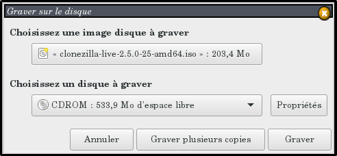
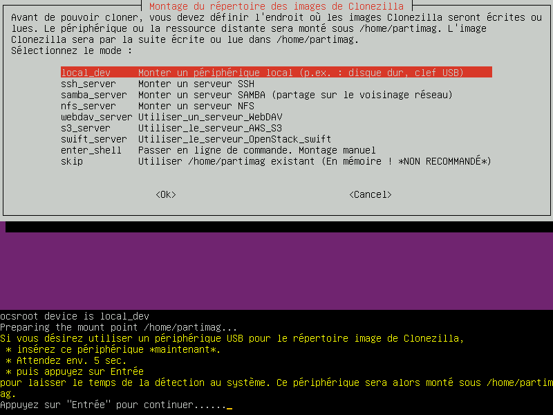
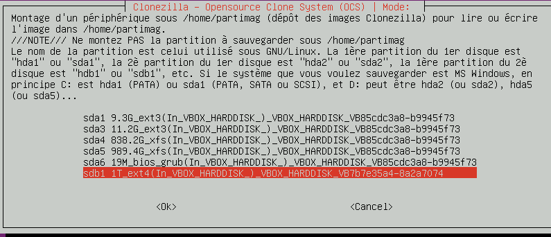
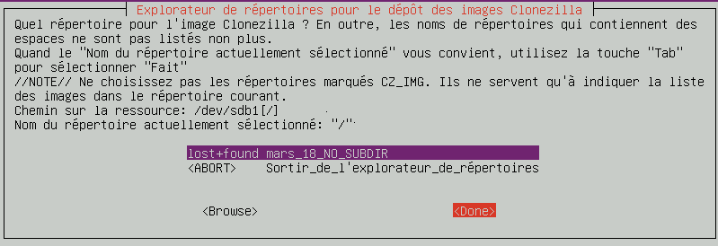
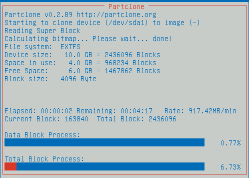
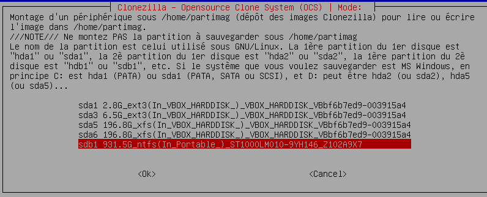
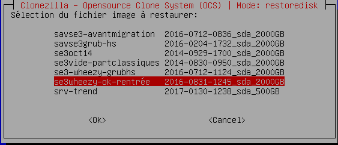

# Cloner un `se3`

… article en chantier...mais qui avance! …

* [Présentation](#présentation)
* [Préparation de `Clonezilla`](#préparation-de-clonezilla)
    * [Télécharger `Clonezilla`](#télécharger-clonezilla)
    * [Graver sur un `CD`](#graver-sur-un-cd)
        * [En mode graphique](#en-mode-graphique)
        * [En ligne de commande](#en-ligne-de-commande)
    * [Copier sur une clé `usb`](#copier-sur-une-clé-usb)
* [Préparation du support de sauvegarde](#pr%C3%A9paration-du-support-de-sauvegarde)
* [Clonage d'un disque du `se3`](#clonage-dun-disque-du-se3)
    * [Quelques remarques](#quelques-remarques)
    * [Lancement de `Clonezilla`](#lancement-de-clonezilla)
    * [Redémarrer le `se3`](#redémarrer-le-se3)
* [Restauration d'une image sur un des disques du `se3`](#restauration-dune-image-sur-un-des-disques-du-se3)
* [Références](#références)


## Présentation

Le but est de se sortir très rapidement d'une situation critique à l'aide d'images récentes des disques du se3. Cela peut se produire lors d'une mise à jour du se3 pouvant poser problème ou si lors d'une migration (par exemple de Wheezy à Jessie) a lieu une coupure du réseau électrique ou autre événement imprévu de cet ordre, événement improbable mais dont la probabilité n'est pas à négliger.

Il est aussi tout à fait possible de restaurer cette image sur une machine virtuelle pour ses tests personnels. Ainsi, vous disposez d'une vm ayant exactement les mêmes paramètres que le serveur de prod. Il faut quand même faire quelques ajustements (proxy, utiliser un routeur virtuel ayant le même plan d'adressage ip que le se3).

Voici ce que nous vous proposons pour la fabrication des images des disques du `se3` :

- graver `Clonezilla` sur un `CD`
- redémarrer le `se3` via le `CD` pour se trouver avec `Clonezilla` en `live`
- repérer le disque à transformer en une image
- repérer un périphérique local : un disque externe `usb` convient (ou un `NAS`) ? Si j'ai la place, je peux utiliser celui qui me sert pour la vraie sauvegarde en créant à sa racine un répertoire /image_se3 par exemple.
- lancer le clonage → la sauvegarde du disque dur contenant uniquement la racine, var et le swap a durée 24 minutes montre en main sur un disque externe usb 2.0. Cette sauvegarde fait une vingtaine de Go.
- recommencer, avec le 2ème disque qui contient `/home` (par exemple), les étapes 3, 4 et 5 (si on a une autre vraie sauvegarde par script, cette opération n'est peut-être pas utile, mais sait-on jamais...)


## Préparation de `Clonezilla`

Il s'agit de télécharger `Clonezilla` et de le graver sur un `CD` ou de le copier sur une clé `usb`, les deux solutions étant possibles.


### Télécharger `Clonezilla`

On télécharge une archive de `Clonezilla` selon le média utilisé : `CD` ou clé `usb`.

* pour un `CD`
```sh
wget https://osdn.net/projects/clonezilla/downloads/67139/clonezilla-live-2.5.0-25-amd64.iso
```

* pour une clé `usb`
```sh
wget https://sourceforge.net/projects/clonezilla/files/clonezilla_live_stable/2.5.0-25/clonezilla-live-2.5.0-25-amd64.zip
```

**Remarque :** la version stable indiquée dans les lignes de commande ci-dessus est la **2.5.0-25**. Vérifiez [sur le site de Clonezilla](http://clonezilla.org/downloads/download.php?branch=stable) que c'est bien toujours la version stable et, si elle a changé, n'hésitez pas à modifier la référence correspondante.


### Graver sur un `CD`

#### En mode graphique

* Insérez un `CD` dans le lecteur de votre ordinateur  
Avec une taille supérieure à la taille de l'image `iso` (supérieure à 205 Mo environ)

* Cliquez-droit sur l'archive téléchargée **clonezilla-live-2.5.0-25-amd64.iso**  
Dans le menu contextuel, choisir **Graver sur le disque…**  
Vous obtenez la fenêtre suivante :  


* Lancez la gravure du `CD`  
Cliquez sur **Graver**  
Une confirmation est demandée…  
  
Cliquez sur **Effacer le disque**

* Plusieurs étapes lors de la gravure  
Après l'effacement du disque, a lieu la gravure de l'archive `iso`, la fermeture du disque, la création d'une somme de contrôle et enfin l'éjection du disque gravé.

Le `CD` contenant `Clonezilla` est prêt à être utilisé : [voir ci-dessous](#clonage-dun-disque-du-se3).


#### En ligne de commande

… à venir …


### Copier sur une clé `usb`

… à venir …

## Préparation du support de sauvegarde

La sauvegarde peut-être faite sur un partage `samba`, mais il sera bien plus pratique d'effectuer cette sauvegarde sur un disque dur externe.

Le disque dur peut-être en partition `fat32`, `ntfs`, `ext3` ou `ext4`. Un très grand nombre de formats sont pris en charge par `Clonezilla`. La sauvegarde est découpée en fichiers de 4Go, donc le format `fat32` est aussi valable.
Les sauvegardes sont compressées, un disque de 1To peut donc servir de sauvegarde pour un se3 placé sur un disque de 2 To.

Le disque peut contenir d'autres fichiers. De ce fait, l'utilisation du disque dur externe servant à [la sauvegarde par le script **sauve_se3.sh**](sauverestaure.md#sauvegarder-et-restaurer-un-serveur-se3) peut convenir.


**NB :  L'image clonezilla constituée de plusieurs fichiers en tout genre sera enregistrée automatiquement dans un répertoire portant le nom que vous donnerez à cette image. Si vous souhaitez que cette image soit dans un sous-répertoire, alors il faut le créer avant. Ce sous-répertoire ne doit pas contenir d'espace.**


## Clonage d'un disque du `se3`

Une fois un `CD` ou une clé `usb` prêt, on peut redémarrer le `se3`, et lancer la création des images des disques durs.


### Quelques remarques

Évidemment, le serveur sera indisponible pendant un certain temps… Pensez à prévenir les utilisateurs ; mais le mieux est de choisir un moment où aucun utilisateur n'est présent, ou du moins le moins possible.

Si le serveur est sur des partitions classiques sans `LVM`, et que les `home` et `/var/se3` sont sur des disques séparés, alors la sauvegarde sera relativement rapide (compter une demi-heure pour la sauvegarde suivie de vérification). En effet, le disque ne contient que la racine `/`, la partition `/var` et le `swap`.

Cette opération sera à répeter **avant** chaque changement important concernant le `se3` (et aussi **après**, si tout s'est bien déroulé). Une gestion rigoureuse n'est pas à négliger…


### Lancement de `Clonezilla`

On met le `CD` dans le lecteur de `CD` ou bien on branche la clé `usb` sur le port `usb` puis on redémarre le `se3` sur ce média pour obtenir `Clonezilla` en `live`.

Un certain nombre de choix successifs doivent être réalisés :

**1. Choisir la bonne *langue* et le bon codage *clavier***  
Si le clavier est toujours en qwerty, il faut alors utiliser *Choisir un clavier dans la liste complète, puis PC-azerty-Same As X11*  


**2. Choisir le mode *device-image disque/partition vers/depuis image***  


**3. Choisir de monter un périphérique local**  
Une liste des supports possibles de sauvegarde apparait  
(disque dur, partage samba, connexion en ssh,…).  
  
On branche le disque dur externe puis on attend quelques secondes que le disque dur externe soit bien détecté par le système (on ne voit pas, ici, si le disque est bien reconnu, mais on pourra le vérifier dans l'étape d'après).  
**On appuie sur `Entrée`**  
Clonezilla va donc faire un du listing de tous les disques locaux.

Sur la photo suivante, `Clonezilla` a bien détecté :  
→ le disque dur du `se3` à sauvegarder de 2 To (sda)  
→ le disque dur de sauvegarde de 1To (sdb)  
  
Comme indiqué sur l'image, on effectue la combinaison de touches `CTRL+C` pour quitter cette fenêtre et passer à la suivante.

Une analyse de chaque partition va être faite  

**4. Choisir le bon disque de sauvegarde**  
sdb dans le cas présent…  
  
  
`Clonezilla` étant un `livecd` basé sur `Débian` (ou `Ubuntu` selon la version choisie) , il possède une arborescence `Linux` et donc un répertoire `home`. `Clonezilla` a donc besoin de créer la sauvegarde dans son répertoire `/home/partimag/`.
  
Le disque de sauvegarde sera monté *automatiquement* par le `livecd` comme son `/home/partimag` (home qui n'a rien à voir avec celui du `se3` évidemment, `Clonezilla` faisant exactement la même chose pour une image d'un poste Windows). Aucun répertoire n'est à créer et aucune manipulation en ligne de commande n'est à faire.

**5. Choisir où placer l'image du `se3`**  
Cette image sera mise *automatiquement* dans un répertoire qui portera le nom que vous donnerez à l'image :  
* directement à la racine du disque (choisir *Done*)  
* ou dans un sous-répertoire (choisir *Browse*)  
  
Si on choisit *Done*, l'image sera donc à la racine du disque :
  
  
**Remarque :** si vous vouliez que cette sauvegarde soit dans un sous-répertoire, vous pouvez utiliser la combinaison de touches `CTRL+ALT+F2` pour ouvrir un deuxième terminal. On se connecte en root en faisant `sudo su` puis `Entrée`. Il faut ensuite aller dans le répertoire `/home/partimag` et créer le sous-répertoire `mkdir nom_du_répertoire`. Une fois celui-ci créé, on retourne dans l'écran précédent en utilisant la combinaison de touches `CTRL+ALT+F`.

**6. Choisir le mode *débutant**  
Le mode *débutant* est bien plus simple à utiliser que le mode *expert* qui propose des options inutiles pour une simple sauvegarde du se3.  

**7. Choisir le type de sauvegarde :**  
- ou `savedisk` pour le disque entier  
- ou `saveparts` pour ne sauvegarder que quelques partitions  
  
**Remarque :** on peut restaurer seulement quelques partitions avec une image de disque entier. De même, si on ne souhaite sauvegarder que les partitions racines `/`, `/var` et `swap` parce qu'on a d'autres sauvegardes des `home` et `/var/se3`. Dans ces cas, on utilisera `saveparts`.

**8. Choisir le disque qui sera sauvegardé**  
celui qui contient la racine du `se3`  
**NB :** le disque de sauvegarde (sdb), ayant été choisi pour y mettre l'image du disque,  
n'apparait plus dans la liste des disques à sauvegarder  
  

**9. Choisir le nom de la sauvegarde**  
Par exemple : se3-wheezy-avant-samba-4.4_date  
  

**10. Choisir de vérifier le disque du `se3`**  
Utile uniquement pour les partitions `Linux` ,ce qui est donc le cas ici. On en prendra pas l'option "réparer automatiquement". 

**11. Choisir de vérifier l'image sauvegardée**  
  

**12. Appuyer sur la touche `y` pour enfin lancer la sauvegarde après la demande de validation**  

**Et voilà, la sauvegarde du `se3` est en cours…**  
  


### Redémarrer le `se3`

Une fois l'image effectuée, et s'il ny en a pas d'autres à réaliser, vous pouvez redémarrer le `se3` pour reprendre son fonctionnement normal.

N'oubliez pas d'enlever le `CD` ou la clé `usb`.


## Restauration d'une image sur un des disques du `se3`

Et oui, la catastrophe est arrivée… mais vous avez une image `Clonezilla` qui va vous permettre de remettre en ordre de marche votre `se3`. Suivez le guide !

Avant de commencer, il convient de préciser qu'une restauration doit toujours être faite avec une version de `Clonezilla` au moins aussi récente que celle ayant servi à la sauvegarde (il peut-être indiqué "disque cible trop petit" alors que le disque fait pourtant la bonne taille.

La procédure est quasi similaire à celle de la sauvegarde, à l'exeption près qu'il faudra choisir "restore disk" au lieu de "save disk".

- choisir "device-image disque/partition vers/depuis image/partition"
- choisir "Monter un périphérique local"
- Brancher le disque du externe contenant les sauvegardes et attendre quelques secondes
- On vérifie que le disque de sauvegarde et le disque du se3 sont bien détectés (CTRL+C pour continuer).
- On choisit le disque dur de sauvegarde pour être monté sous /home/partimag du livecd

- On se place dans le répertoire contenant la sauvegarde puis on va sur 'done' (la racine si on a pas utilisé de sous répertoire. Dans ce cas, le nom de la sauvegarde apparait dans la liste).
- On choisit le 'mode débutant' (le mode expert n'est pas utile pour une restauration simple).
- On choisit 'restoredisk' si on veut restaurer le disque entier, ou 'restoreparts' si on veur restaurer seulement une partition du se3.
- On choisit la sauvegarde que l'on souhaite restaurer (exemple : se3-avant-samba-4.4).

- On indique quel disque dur sera à restaurer (l'idéal étant de ne garder dans le serveur seulement le disque à rstaurer pour éviter toute confusion. Si tous les disques sont présents, il faut bien regarder la taille des disques our éviter d'écraser le mauvais).

* Si l'image a été vérifiée lors de sa création, il n'est pas utile de vérifier si elle est bien restaurable.
- CHoisir ce que fera le livecd après restauration (reboot, halt).
- Valider *deux fois* pour lancer la restauration.

Une fois le disque restauré, on rallume le serveur normalement après avoir oté le live-cd cd 'Clonezilla'.

Remarque: Si vous diposez d'un second disque dur identique à celui du se3, il peut-être judicieux de restaurer la sauvegarde sur ce disque (avec un ordinateur ouvert et déconnecté du réseau pour éviter un conflit d'ip avec 'deux se3'), déjà pour vérifier que tout fonctionne bien et aussi pour gagner du temps en cas de crash disque/problème logiciel puisqu'il suffira de les échanger. Les ordinateurs de l'établissement pourront fonctionner en attendant qu'une restauration des homes et var/se3 soit faite.


## Références

* Le site de [Clonezilla](http://clonezilla.org/) : of course !
* La page [Clonezilla d'Ubuntu](https://doc.ubuntu-fr.org/clonezilla), à ne pas négliger
* Un tutoriel d'[utilisation de Clonezilla](http://www.fredzone.org/tutoriel-clonezilla-sauvegarde-restauration-disque-dur)

