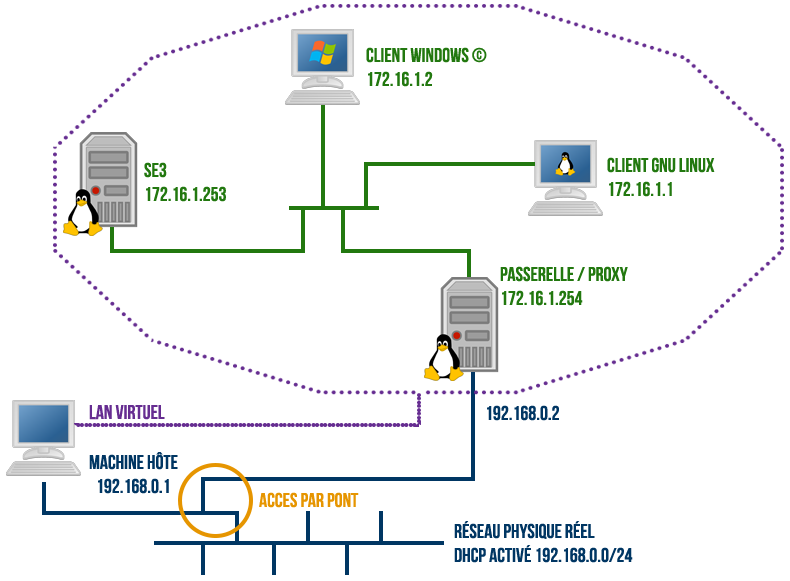
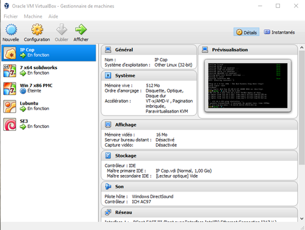
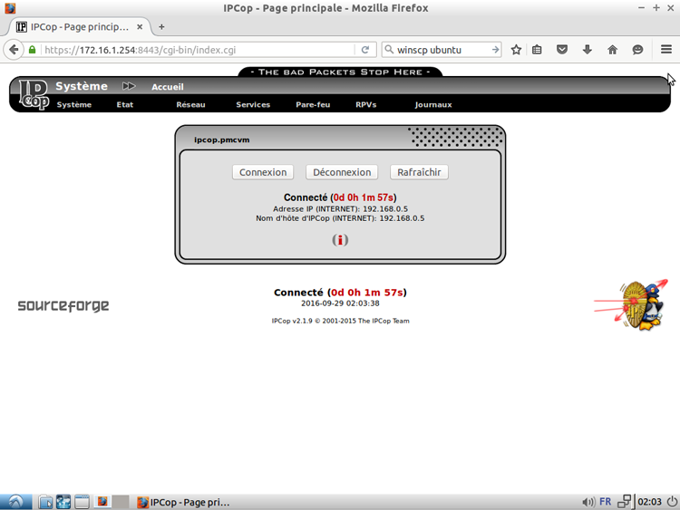
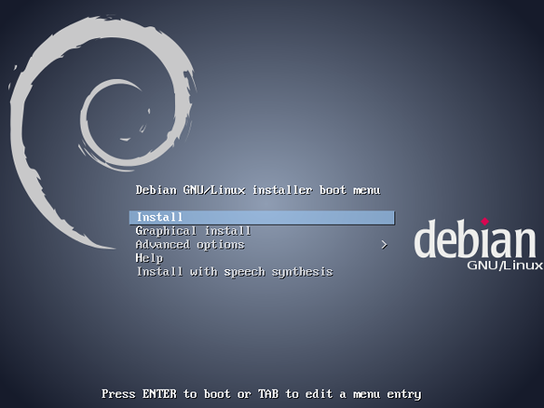
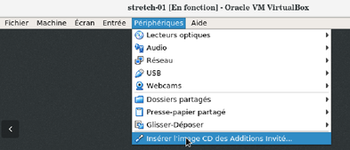

# Installer un réseau `SE3` avec `VirtualBox`

* [Introduction](#introduction)
* [Installation de `VirtualBox`](#installation-de-virtualbox)
  * [Installation](#installation)
    * [Windows](#windows)
    * [Ubuntu](#ubuntu)
    * [Debian](#debian)
  * [Vue générale après l'installation](#vue-générale-après-linstallation)
  * [Réglages après l'installation](#réglages-après-linstallation)
* [Installation des machines virtuelles](#installation-des-machines-virtuelles)
  * [Étape 1 : Installation d'`IPCop`](#Étape-1--installation-dipcop)
    * [Récupération de tout le nécessaire](#récupération-de-tout-le-nécessaire)
    * [Création de la machine virtuelle](#création-de-la-machine-virtuelle)
    * [Installation](#installation)
    * [Paramétrage post-installation](#paramétrage-post-installation)
  * [Étape 2 : Installation du `SE3`](#Étape-2--installation-du-se3)
    * [Récupération de tout le nécessaire](#récupération-de-tout-le-nécessaire)
    * [Création du fichier `Setup_se3.data`](#création-du-fichier-setup_se3data)
    * [Création de la machine virtuelle](#création-de-la-machine-virtuelle)
    * [Installation d'un système `Debian` basique](#installation-dun-système-debian-basique)
    * [Installation des paquets `SE3`](#installation-des-paquets-se3)
    * [Configuration post-installation](#configuration-post-installation)
    * [Cas particuliers d'installation](#cas-particuliers-dinstallation)
  * [Étape 3 : Installation des clients virtuels](#Étape-3--installation-des-clients-virtuels)
    * [Paramètres réseau des `VMs`](#paramètres-réseau-des-vms)
    * [Client `Windows 7`](#client-windows-7)
    * [Client `Windows 10`](#client-windows-10)
    * [Client `Linux`](#client-linux)
        * [Installation des `Additions invités`](#installation-des-additions-invités)
* [Virtualisation d'un réseau avec une autre passerelle](#virtualisation-dun-réseau-avec-une-autre-passerelle)
  * [`SLIS 4`](#slis-4)
  * [`AMON`](#amon)
* [Disques durs virtuels prêts à l'usage](#disques-durs-virtuels-prêts-à-lusage)


## Introduction

L'objectif est d'obtenir un réseau `LAN` sous `VirtualBox` avec la possibilité d'installer assez facilement un réseau de machines virtuelles administrées par un serveur `SE3`, lui aussi virtuel, le tout derrière une passerelle/proxy sous `IPCop`.

On reprend son souffle, en image cela donne:



**Remarque :** on peut voir que le réseau virtuel a pour adresse `172.16.1.0/24` et le réseau physique a pour adresse `192.168.0.0/24`. Ce sont ces paramètres qui seront repris dans les exemples de cette documentation. On pourra bien entendu avoir d'autres paramètres pour le réseau physique et le réseau virtuel.

Tout ce travail dans l'optique de tester :
* les actions de maintenance du `SE3` avant de les reproduire sur le vrai serveur ;
* l'intégration de systèmes d'exploitation différents ;
* l'installation de logiciels via `WPKG` sur les clients-windows ;
* des bidouilles sans casser un serveur en production ;
* …

___

>_En fonction des capacités de la machine hôte il pourra être difficile d'avoir accès à tous les systèmes virtuels en même temps de façon confortable. Une bonne quantité de mémoire vive et disposer d'un disque dur dédié aux images virtuelles des systèmes est un plus. ;-)_

>_La procédure proposée par la suite implique une configuration avec une `IP` distribuée par un serveur `DHCP` à la carte réseau côté `WAN` du serveur `IP-Cop`. Si l'environnement est différent il sera nécessaire d'adapter la configuration RED à l'installation d'`IP-Cop`._

___


## Installation de `VirtualBox`

### Installation

#### Windows

Pour télécharger le programme d'installation sous `Windows©`, il suffit de se rendre sur le site de [VirtualBox](https://www.virtualbox.org/).

Il suffit, ensuite, de double-cliquer sur le fichier exécutable téléchargé. L'installation est classique pour un logiciel sous `Windows©` en choisissant l'installation standard.


#### Ubuntu

_--> Coming soon <--_


#### Debian

Conformément à [la documentation sur le Wiki/Debian](https://wiki.debian.org/VirtualBox#Debian_9_.22Stretch.22), à partir de la version 9 (`Debian/Stretch`), on peut utiliser le dépôt `Oracle` qui propose la version stable la plus à jour.

Les commandes suivantes se feront en `root` et concernent une `Debian/Stretch`.

- Ajout de la source du dépôt
```sh
echo "deb https://download.virtualbox.org/virtualbox/debian stretch contrib" >> /etc/apt/sources.list.d/virtualbox.list
```
- Ajout de la clé publique du dépôt
```sh
wget -q --show-progress -O- https://www.virtualbox.org/download/oracle_vbox_2016.asc | apt-key add -
```
- Rechargement de la liste des paquets et installation de `VirtualBox`
```sh
apt-get update
apt-get install virtualbox-5.2
```

Par la suite, les mises à jour se feront en même temps que les mises à jour de `Debian/Stretch` :
```sh
apt-get update && apt-get upgrade
```


### Vue générale après l'installation

Voici à quoi ressemble la fenêtre de `VirtualBox`, elle contient déjà ici quelques `VMs` (machines virtuelles). 




### Réglages après l'installation

Les seuls paramètres que j'ai modifié sont les chemins de stockage des fichiers correspondants aux machines virtuelles. Pour cela, dans la barre des menus de la console, vous cliquez sur *Fichier* puis sur *Paramètres*.

Vous pouvez alors indiquer où vous souhaitez enregistrer les fichiers pour les dossiers par défaut des machines dans l'onglet Général.

Si vous souhaitez utiliser des périphériques `USB` sur les systèmes virtuels, il est intéressant d'installer également [le pack d'extension](https://download.virtualbox.org/virtualbox/5.2.8/Oracle_VM_VirtualBox_Extension_Pack-5.2.8.vbox-extpack). Téléchargez-le puis, dans l'interface de gestion de `VirtualBox`, l'entrée `Fichiers/paramètres/extension` vous permettra de l'ajouter. Par la suite, l'interface de `VirtualBox` devrait gérer les mises à jour du `pack d'extension`.


## Installation des machines virtuelles

### Étape 1 : Installation d'`IPCop`

#### Récupération de tout le nécessaire
* [Image ISO (Sourceforge)](https://sourceforge.net/projects/ipcop/files/IPCop/IPCop%202.1.8/ipcop-2.1.8-install-cd.i486.iso/download)
* [Manuel d'installation (EN)](http://www.ipcop.org/2.0.0/en/install/html/)
* [Manuel d'administration (EN)](http://www.ipcop.org/2.0.0/en/admin/html/)


#### Création de la machine virtuelle

Via l'interface de `VirtualBox`, créer une nouvelle machine virtuelle en cliquant sur le bouton *Nouveau* avec les paramètres suivants : 

```sh
* Nom : IPCop | Type : Linux | Version : Other Linux (32-bit)
* Ram : 256 à 512 Mo
* Créer un disque dur virtuel maintenant | VDI | Taille fixe | 1 Go
```

Sur la machine virtuelle nouvellement créée, clic-droit et *Configuration* pour paramétrer les préférences de la `VM` :

* Onglet *Stockage* :

```sh
Insérer l'iso d'IPCop dans le lecteur optique virtuel
```

* Onglet *Réseau* :

```sh
* Carte 1 | Mode d'accès réseau : Accès par pont | Mode Promiscuité : Tout autoriser
* Carte 2 | Mode d'accès réseau : Réseau interne | Nom : intnet (ou à votre convenance) | Mode Promiscuité : Autoriser les VMs
```


#### Installation

Double-cliquer sur la machine virtuelle pour la démarrer, à l'écran `boot :`, appuyer simplement sur la touche `Entrée` pour lancer l'installation et saisir les paramètres suivants :
>_Navigation avec la touche `Tab` et sélection des listes de choix avec la touche `Espace` ;-)_

```sh
* Langue : French | Valider écran suivant par Ok | Clavier : fr | Fuseau horaire : Europe/Paris | Date - Heure : Contrôler et valider par Ok
```

Le système charge des fichiers puis arrive sur l'écran du disque dur d'installation, saisir :

```sh
* Installation Disque : 'sda: VBOX HARDDISK' apparaît, valider par ok
* Valider par Ok le message de confirmation du formatage
* Sélectionner Disque Dur comme type d'installation
```

Les derniers fichiers sont copiés, à l'écran *Restaurer*, sélectionner *Passer* pour arriver à l'écran de fin d'installation. Passer en sélectionnant *Félicitations!*.

La configuration du système commence, saisir les paramètres suivants en validant par *Ok* :

```sh
* Nom d'hôte : ipcop 
* Nom de domaine : localvm
* interface RED : DHCP
```

À l'écran *Affectation des cartes*, il est nécessaire d'affecter la carte 1 (`eth0`) en "Accès par pont" au réseau `RED` (côté `WAN`) et la carte 2 (`eth1`) en "Réseau interne" au réseau `GREEN` (côté `LAN`). Pour cela mettre en surbrillance la carte et choisir l'option *Sélectionner* avec la touche `Tab`. Dans le menu choisir `RED` ou `GREEN` en fonction du cas puis *Assigner*. Une fois fini, valider par *Continuer*.

>_Normalement à cette étape, la première carte du menu est `eth0` et la seconde `eth1`, si vous avez un doute vérifiez les adresses `MAC`. Les paramètres réseau de la `VM` sont accessibles depuis l'icône en bas de la fenêtre de virtualisation ou depuis le fenêtre principale de `VirtualBox`._

Pour les écrans suivants, saisir les paramètres ci-dessous :

* Interface `GREEN` :

```sh
* Adresse IP : 172.16.1.254
* Masque du réseau : 255.255.255.0
```

* Interface `RED` :

```sh
* Nom d'hôte DHCP : ipcop
```

* Configuration du `DNS` et de la passerelle :

```sh
Passer cette étape
```

> _(sauf si vous n'utilisez pas de `DHCP` sur le réseau physique)_

* Configuration du serveur `DHCP` :

```sh
Passer cette étape
```

> _On se servira du `SE3` comme `DHCP` par la suite, en attendant il suffira de déclarer manuellement les paramètres réseau sur les autres `VMs`_

Il reste à définir les différents mots de passe pour le compte *root*, 'admin' et la clé de cryptage.

> _6 caractères minimum sont requis, dans le cadre de serveurs de test 'admin!' pour chaque compte peut convenir pour se simplifier la vie, évidemment sur des serveurs en production c'est une bien mauvaise idée. ;-)_

Valider l'écran de fin via *Félicitations!*. Le serveur `IPCop` redémarre et est presque prêt à être utilisé, il ne reste que quelques paramétrages à réaliser via son interface web. 


#### Paramétrage post installation

Pour cela il va nous falloir un client sur le réseau `LAN` virtuel :

>_Il est possible d'accéder à l'interface depuis le côté `WAN`, se référer à la doc (EN) ou prendre un peu d'avance en installant un client qui servira par la suite._

```sh
* choisir l'OS qui vous plaît et l'installer sur une `VM` avec pour la configuration réseau : 'Mode d'accès réseau : Réseau interne' | Nom : intnet | Mode Promiscuité : Autoriser les VMs
* Paramétrer la connexion réseau en manuel une fois l'OS installé
```

Accéder à l'interface d'administration d'`IPCop` via l'url `https://172.16.1.254:8443`, accepter le certificat et saisir le login *admin* et mot de passe pour arriver sur cette page :



Depuis le menu **Système**, sélectionner **Mises à jour** et appliquer la mise à jour disponible.

Depuis le menu **Services**, sélectionner **Serveur mandataire (proxy)** et saisir les paramètres :

```sh
* Cocher Activé sur VERT
* Cocher Mode transparent VERT
* Port serveur mandataire : 3128
* Langues des messages d'erreurs : French
* Enregistrer
```

La passerelle/proxy est prête ! 


### Étape 2 : Installation du `SE3`

#### Récupération de tout le nécessaire

* [ISO Debian 7.11.0 i386](http://cdimage.debian.org/cdimage/archive/7.11.0/i386/iso-cd/debian-7.11.0-i386-netinst.iso)
* [ISO Debian 7.11.0 amd64](http://cdimage.debian.org/cdimage/archive/7.11.0/amd64/iso-cd/debian-7.11.0-amd64-netinst.iso)


#### Création du fichier `Setup_se3.data`

Compléter le formulaire [Créer un fichier setup_se3.data](http://dimaker.tice.ac-caen.fr/dise3xp/se3conf-xp.php?dist=wheezy) avec les paramètres suivants :

>_Conserver bien l'adresse URL du fichier de sortie que l'on ira chercher avec un wget par la suite_

```sh
Hôte et domaine :
* Nom d'hôte : SE3VM
* Domaine : localvm

Mots de passe :
* Super utilisateur : dise3
* Administrateur MySQL : admin!
* RDN Administrateur LDAP : admin
* Admin annuaire LDAP : admin!
* Administrateur du SE3 : admin!
* Compte admin local XP / Seven : admin!

Partitions du disque SE3 : 
Paramètres inutiles ici, le fichier preseed ne servira pas.""

Services LDAP :
* LDAP Base DN : dc=local
* Domaine de courrier utilisateur LDAP : localvm

Configuration réseau :
* Interface Ethernet : eth0
*  Passerelle par défaut : 172.16.1.254
* Adresse IP : 172.16.1.253
* Adresse du réseau : 172.16.1.0
* Adresse de diffusion : 172.16.1.255
* Masque de sous réseau : 255.255.255.0
* Serveur de nom primaire : 172.16.1.254
* Serveur de nom secondaire : 212.27.40.240
* Serveur de temps : ntp.ac-versailles.fr

Paramètres serveurs annexes :
* Utilisation d'un serveur proxy : Oui 
* Adresse IP du proxy : 172.16.1.254
* Port du proxy : 3128
* Utilisation d'un serveur de communication LCS : Non 

Paramètres de samba :
* Installation auto de l'interface web : Oui
* Configuration auto du SE3 : Oui
* Adresse IP du LDAP : 172.16.1.253
* Nom de Domaine Samba : SAMBAEDU3-VM
* Nom Netbios du serveur : se3
```

Ou pour les moins courageux, télécharger celui-ci [Setup se3.zip](http://wiki.dane.ac-versailles.fr/index.php?title=Fichier:Setup_se3.zip), qu'il faudra copier sur le serveur via une clé `USB`.


#### Création de la machine virtuelle

Sur `VirtualBox`, créer une nouvelle machine virtuelle en cliquant sur le bouton *Nouveau* avec les paramètres suivants :

```sh
* Nom : SE3 | Type : Linux | Version : Debian (32-bit pour l'iso i386 ou 64-bit pour l'iso amd64)
* Ram : 2048 Mo
* Créer un disque dur virtuel maintenant | VDI | Taille fixe | 80 Go
```

Paramétrer les préférences de la `VM` :

* Onglet *Stockage* :

```sh
Insérer l'iso de debian dans le lecteur optique virtuel
```

* Onglet *Réseau* :

```sh
Carte 1 | Mode d'accès réseau : Réseau interne | Nom : intnet | Mode Promiscuité : Autoriser les VMs
```


#### Installation d'un système `Debian` basique

Double-cliquer sur la machine virtuelle pour la démarrer, puis sélectionner *Install* avec la touche *Entrée* :



Saisir les paramètres de localisation :

```sh
* Select a language : French
* Choix de votre situation géographique : France
* Configurer le clavier : Français
```

Le système charge des fichiers, puis enchaîne avec la configuration réseau qui échoue sans `DHCP`, saisir `Continuer` dans la fenêtre puis saisir :

```sh
* Configurer le réseau : Configurer vous-même le réseau
* Adresse IP : 172.16.1.253
* Masque réseau : 255.255.255.0
* Passerelle : 172.16.1.254
* Adresse des serveurs de noms : 172.16.1.254
* Nom de machine : SE3VM
* Domaine : localvm
```

Le système demande ensuite la création des utilisateurs et leurs mots de passe :

```sh
* Mot de passe 'root' : admin!
* Nom complet du nouvel utilisateur : à votre convenance
* Identifiant pour le compte utilisateur : à votre convenance
* Mot de passe pour le compte utilisateur : à votre convenance
```

On arrive ensuite sur l'étape de partitionnement manuel du disque :

Saisir les partitions suivantes _(La table de partition ci-dessous est prévue pur un disque virtuel de 80 Go, si vous faites plus grand, augmenter en priorité la taille de `/home` puis `/var/se3/` )_:

```sh
* 5 GB | Primaire | Début | Système de fichier ext 3 | Point de montage : /
* 10 GB | Primaire | Début | Système de fichier ext 3 | Point de montage : /var
* 43,9 GB | Logique | Début | Système de fichier XFS | Point de montage : /home
* 25 GB | Logique | Début | Système de fichier XFS | Point de montage : /var/se3
* 2 GB | Logique | Début | espace d'échange ("swap")
```

L'installation se déroule puis demande la saisie des paramètres de miroirs pour les mise à jour et de proxy :

```sh
* Configurer l'outil de gestion des paquets : France
* Configurer l'outil de gestion des paquets : ftp.fr.debian.org
* Proxy : http://172.16.1.254:3128
```

À l'écran *Sélection des logiciels*, sélectionner :

```sh
serveur d'impression | serveur SSH | Utilitaires usuels du système
```

Puis continuer, à la demande d'installation du `Grub`, répondre *Oui* pour arriver sur l'écran de fin. Sélectionner **Continuer** pour redémarrer.


#### Installation des paquets `SE3`

Après le redémarrage du système `Debian`, nous allons passer à l'installation des paquets `SAMBAEDU3`, pour cela connecter vous en tant que *root* et utiliser le fichier **setup_se3.data** pour automatiser la fin de l'installation.

* Récupération et déplacement du fichier **setup_se3.data**

saisir une après l'autre les commandes suivantes :

```sh
cd /root
```

```sh
mkdir /etc/se3/
```

```sh
wget http://dimaker.tice.ac-caen.fr/dise3wheezy/XXXX/setup_se3.data
```

_Adapter l'URL à votre fichier!_

```sh
mv setup_se3.data /etc/se3/
```

* Récupération du script **install_phase2.sh**


saisir une après l'autre les commandes suivantes :

```sh
cd /root
```

```sh
wget http://dimaker.tice.ac-caen.fr/dise3wheezy/se3scripts/install_phase2.sh
```

```sh
chmod +x install_phase2.sh
```

```sh
./install_phase2.sh
```

La seconde partie de l'installation commence à cet instant. Si le fichier **setup_se3.data** est au bon endroit et complet, la suite se poursuivra sans vous pour la configuration, sinon le script demandera les détails en mode interactif.

L'installation se termine avec la mise à jour vers la dernière version ainsi que le changement de mot de passe *root*. Le serveur est alors fonctionnel et administrable via l'interface web.


#### Configuration post installation

Depuis le client qui a servi pour `IPCop` précédemment, connectez-vous à l'interface `http://172.16.1.253:909` et activer puis configurer immédiatement le serveur `DHCP`.

Par la suite importer les clés de registres, installer les autres modules… Administration classique d'un serveur `SE3`… cela ne devrait plus avoir de secret pour vous ! ;-)


#### Cas particuliers d'installation

_--> Partie non révisée. <--_

* Installation sur 2 disques durs :

Il est possible de tester une installation sur 2 disques durs virtuels. J'ai fait un essai avec la version 3.1.2 de `VirtualBox` sans aucun problème notable. Pour le descriptif de la marche à suivre, vous pouvez lire l'article que j'ai écrit sur le site `SambaEdu3` de l'académie de Versailles.

* Installation sur 3 disques durs :

Il est possible de tester une installation sur 3 disques durs virtuels mais sans utiliser l'installateur `Digloo`. Les essais d'une telle installation ont été faite avec la version 4 de `VirtualBox` sans aucun problème.

Pour mener à bien mes essais, j'ai suivi les indications qui se trouvent au paragraphe 2.2.1 page 14 de la documentation disponible sur www.samba-edu.ac-versailles.fr.

J'ai juste modifié le partitionnement proposé de la façon suivante :

```sh
DD1 : 4 partitions avec swap, / , /var et /home/admin
DD2 : 1 partition avec /var/se3
DD3 : 1 partition avec /home 
```

À titre indicatif, voici les tailles virtuelles des différentes partitions des disques durs virtuels : DD1 (8 Go dont 1 Go pour le swap, 3 Go pour la racine /, 3 Go pour /var et 1 Go pour /home/admin), DD2 (5 Go) et DD3 (5 Go)

**Remarque :** pour des disques réels, cela dépend des capacités disponibles. Cependant, pour le disque dur 1, les recommandations sont de 2 Go pour le swap, 10 Go pour la partition /, 28 Go pour /var et le reste pour la partition /home/admin, ce qui permet d'être à l'aise pour le compte admin, sans gêner la place disponible pour les autres comptes. Ces répartitions du disque 1 ont été calculées pour un disque dur de 160 Go. 


### Étape 3 : Installation des clients virtuels

#### Paramètres réseau des `VMs`

* Dans la console `VirtualBox`, sélectionner Préférences > Onglet 'Réseau' :

```sh
Carte 1 | Mode d'accès réseau : Réseau interne | Nom : intnet | Mode Promiscuité : Autoriser les VMs
```

#### Client `Windows 7`

Rien de particulier à dire, vous avez sans doute l'expérience d'une installation de `Windows`, le déroulement est identique. Prévoir 40 go minimum d'espace disque pour avoir la place d'y installer quelques logiciels.


#### Client `Windows 10`

_--> Coming soon <--_


#### Client `Linux`

Là aussi, rien de particulier à dire : de nombreux tutoriels vous indiqueront les différentes étapes d'installation d'un système `GNU/Linux`. Prévoir environ 10 Go d'espace disque.


##### Installation des `Additions invités`

Selon l'usage de votre `client-linux`, il peut être pratique d'installer les `Additions invités` : cela vous permettra, par exemple, d'échanger des fichiers entre la machine virtuelle et la machine hôte via un répertoire partagé ou bien d'utiliser la fonction copier/coller entre les deux machines.

Vous trouverez ci-dessous comment les mettre en place pour un système `Debian/Stretch`.

* insérer le CD des additions invité (ne pas lancer le script proposé)

* préparer la machine virtuelle
Dans un terminal en `root` de la machine virtuelle, mettez à jour le système, installez les paquets build-essential et module-assistant et préparez l'installation des modules dans le noyau à l'aide des commandes suivantes :
```sh
apt-get update && apt-get upgrade
apt-get install build-essential module-assistant
m-a prepare
```
* lancer le script de mise en place des Additions invité
```sh
sh /media/cdrom/VBoxLinuxAdditions.run
```
* redémarrer la machine virtuelle
```sh
reboot
```

## Virtualisation d'un réseau avec une autre passerelle

### `SLIS 4`

_--> Coming soon <--_

### `AMON`

_--> Coming soon <--_

## Disques durs virtuels prêts à l'usage

_--> Coming soon <--_


