# Virtualiser ses serveurs avec Proxmox 5

Cet article est avant tout un pense-bête personnel des différentes opérations que j'ai du effectuer pour virtualiser les serveurs de mon lycée. Je laisse donc les pros de proxmox ajouter les précisions techniques importantes (notamment sur les clusters,etc)

* [Présentation](#présentation)
* [Matériel](#matériel)
     * [Controleurs disques](#controleurs-disques)
     * [Disques](#disques)
     * [Pool de stockage](#pool-de-stockage)
     * [RAID 5/6](#raid-5-6)
     * [RAID 10](#raid-10)
     * [cache](#cache)
* [Installation de base du serveur](#installation-de-base-du-serveur)
     * [Choix du mdp root](#choix-du-mdp-root)
     * [Choix du réseau](#choix-du-réseau)
     * [Reglage du proxy](#reglage-du-proxy)
 * [Quelques points à modifier pour la gestion du serveur](#quelques-points-à-modifier-pour-la-gestion-du-serveur)
     * [Configuration de l'envoi de mail par le serveur](#configuration-de-lenvoi-de-mail-par-le-serveur)
     * [Modification des sources](#modification-des-sources)
* [Interface web de gestion](#interface-web-de-gestion)
     * [Accès à l'interface](#accès-à-linterface)
     * [Présentation de l'interface](#présentation-de-linterface)
     * [Contenu des disques](#contenu-des-disques)
* [Ajout de disques durs internes pour stocker les vm ou les sauvegardes](#ajout-de-disques-durs-internes-pour-stocker-les-vm-ou-les-sauvegardes)
* [Création de partage nfs pour sauvegarder les VMS](#creation-de-partage-nfs-pour-sauvegarder-les-vms)
* [Ajout de livecd iso pour booter une vm](#ajout-de-livecd-iso-pour-booter-une-vm)
* [Création de machine virtuelle](#création-de-machine-virtuelle)
     * [Configuration de l'ID de la VM](#configuration-de-lid-de-la-vm)
     * [Configuration du cd-rom](#configuration-du-cd-rom)
     * [Configuration du disque dur](#configuration-du-disque-dur)
     * [Reglage CPU](#reglage-cpu)
     * [Mémoire](#mémoire)
     * [Réseau](#réseau)
     * [Activation de l'affichage](#activation-de-laffichage)
     * [Sauvegarde et restauration de machines virtuelles](#sauvegarde-et-restauration-de-machines-virtuelles)
* [Créer un compte utilisateur](#créer-un-compte-utilisateur)
* [Authentification avec l'annuaire du se3](#authentification-avec-lannuaire-du-se3)
* [Ajout d'un périphérique usb dans une machine virtuelle](#ajout-dun-périphérique-usb-dans-une-machine-virtuelle)
* [Ajout d'un disque dur interne dans le serveur à destination d'une VM](#ajout-dun-disque-dur-interne-dans-le-serveur-a-destination-dune-vm)
* [Migration d'un serveur physique existant vers une VM](#migration-dun-serveur-physique-existant-vers-une-vm)
     * [Création de l'image clonezilla](#création-de-limage-clonezilla)
     * [Restauration de l'image clonezilla sur une VM](#restauration-de-limage-clonezilla-sur-une-vm)
     * [Problèmes possibles](#problèmes-possibles)
 * [Mise à niveau de Proxmox](#mise-a-niveau-de-proxmox)
     
 

## Présentation

Proxmox 5 (version actuelle 5.2) est un puissant système libre (le support est néanmoins payant) de virtualisation basé sur Debian et qui utilise l'hyperviseur KVM (pour de la virtualisation complète), ou des containeurs lxc Il permet à la façon de virtualbox (mais cette fois pour un usage pro) de créer des  snapshots de machine, des sauvegardes complètes et beaucoup d'autres fonctionnalités. 

Le serveur et les vms peuvent se gérer à partir d'une **interface web**, et une gestion possible des comptes utilisateurs va permettre de laisser à des tiers un accès avec plus ou moins de droits sur une machine (comme le serveur bcdi par exemple).  

L'installation pourra se faire avec les paquets proxmox, mais il sera bien plus pratique d'utiliser l'iso toute faite sur le site officiel de proxmox:

https://www.proxmox.com/en/downloads/item/proxmox-ve-5-2-iso-installer

Virtualiser un serveur va avoir plusieurs avantages:
Le premier sera de pouvoir installer plusieurs serveurs sur un même machine physique. On utilise donc pleinement les capacités physiques de son serveur.
Le deuxième sera de pouvoir faire des sauvegardes/restauration complètes ou partielles de machines. On pourra donc facilement revenir en arrière en cas de problème, ou déplacer une machine virtuelle d'un serveur physique vers un autre.

## Matériel

### Controleurs disques

Pour profiter pleinement des fonctionnalités de PVE, l'utilisation de ZFS est fortement conseillée. PVE le propose dès l'installation. 
ZFS est un système de fichiers très sophistiqué, qui remplace le raid, lvm et ext4. Il s'agit d'une solution purement logicielle, qui pour fonctionner avec les performances et la sécurité maximale doit pouvoir accéder directement aux disques.
Toute forme de RAID matériel est donc à proscrire. Plusieurs cas de figure sont possibles : 

- pas de carte raid : les disques sont connectés directement sur les ports SATA de de la carte mère. Inconvénient, ceux-si sont rarement connectables à chaud, et souvent limités à moins de 6. Souvent les perfs sont relativement limitées surtout sur du matériel un peu ancien.
- carte raid SATA/SAS basse/moyenne gamme : il faut configurer la carte dans le bios pour qu'elle soit en mode `JBOD`, `IT mode`, `HBA` ou accès direct au disques. La désignation dépend de la marque. Pour certaines cartes LSI, il est possible de flasher un firmware spécial `IT mode` qui permet d'avoir de bien meilleurs performances. 
- cartes raid avec batteries (BBU) : même remarque que ci dessus, sauf que certains cartes ne permettent pas du tout l'accès direct. Elles sont donc inutilisables. C'est notamment le cas de toutes les DELL PERC6.
- cartes d'extension HBA SAS/SATA : pas de problème, c'est fait spécialement pour...

Si le chassis du serveur le permet, rien n'interdit de répartir les disques sur plusieurs contrôleurs, les perfs n'en seront que meilleures. On peut aussi utiliser une baie de stockage externe.

### Disques

Eviter les disques Sata pour NAS et les disques grand public, ils sont très lents pour les accès simultanés. 

Par ordre de performance : 

- disques SATA serveur ou NearLine SAS : bon rapport capacité-perfs/coût et fiabilité. Compter 230 € pour 4 To
- disques SAS serveur 10 ou 15k : même si ils sont relativement anciens, ces disques sont rapides mais généralement de faible capacité. Cela peut malgré tout valoir le coup de les récuperer.
- SSD grand public : excellentes perfs et prix en baisse, fiablilité correcte. compter 300 € / To
- SSD pro : perfs et fiablilité. Compter 400 € / To. C'est ceux-ci qu'il faut utiliser pour le cache (samsung 850 evo pro).

## Pool de stockage
PVE propose à l'installation de créer directement un poll de stockage global pour tout le systmèe. C'est une bonne idée, car il est très facile de l'étendre ensuite.

Quelques infos concernant les différents types de RAID:

https://buzut.fr/tirez-le-meilleur-de-vos-disques-durs-avec-raid/


Deux solutions sont possibles :
### RAID 5/6
Pour ZFS ce type de pool s'appelle raidz1 ou raidz2. Il comporte 1 ou 2 disques de redondance, et est équivalement à un raid 5 ou 6. 

Avantages : 

- la redondance ne consomme que 1 ou 2 disques

Inconvénients :

- perfs équivalentes à  un seul disque.
- pour augmenter la capacité il faut ajouter le même nombre de disques que ceux présents dans le pool
- raidz1 dangereux (si un deuxième disque meurt pendant le reconstruction, qui peut être très longue...)

### RAID 10
Pour zfs cette solution s'appelle mirror. Il est possible d'ajouter à chaud autant de paires de disques que l'on veut

Avantages :

- ajout de capacité à chaud très simple.
- perfs proportionnelles au nombre de disques.
- sécurité (la probabilité pour que les 2 disques d'une même paire meurent simultanément est faible, et la reconstruction est très rapide)

Inconvénients : 

- la redondance consomme la moitié de la capacité

Dans le cas d'un serveur Sambaedu, la config en miroir raid10 est la meilleure. En revanche pour un serveur de sauvegarde le raidz2 est la meilleure solution.


## Installation de base du serveur

L'installation est **très** simple: très peu de choses sont demandées. On regrêtera cependant le peu de choix concernant le partionnement du serveur.

Dans l'installation présentée ici, il y a trois disques dur:

sda 500 Go
sdb 100 Go 
sdc 500 Go


**Installation classique sur un disque**

On choisit d'installer proxmox sur le premier disque sda.  Les autres disques serviront à stocker des sauvegardes de machines (les snapshots sont placés dans le même espace de stockage que les machines), des fichiers iso de livecd pour les machines,etc...

**Installation sur plusieurs disques en raid avec zfs**
Pour virtualiser un serveur comme le `se3`, il sera clairement conseillé de mettre plusieurs disques serveurs,sas,ssd identiques et d'utiliser un système zfs avec du cache ( aller voir dans `options`) pour de meilleurs performances.

Dans le cas d'un raid 10 (voir plus bas), on pourra mettre au moins 4 disques serveurs, ainsi qu'un ssd pro pour le cache. Dans les options on choisira zfs raid10, on séléctionnera les 4 disques, mais on indiquera bien que **le ssd ne doit pas être utilisé au départ**. La mise du ssd en cache se fera plus tard.

Les machines virtuelles pourront évidemment être en d'autres formats (xfs,ext4,ntfs...)

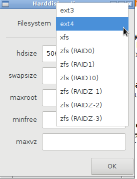


On choisit la langue, ainsi que la ville et le type de clavier.


### **Choix du mdp root**


On entrera une **adresse mail valide** pour que le serveur puisse envoyer des alertes à l'administrateur.

### **choix du réseau**

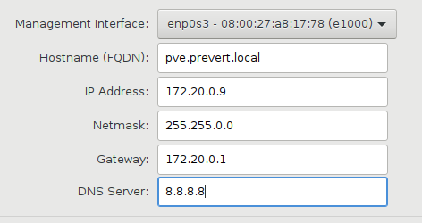

Entrer l'ip du serveur, pour le dns, on pourra choisir l'ip du `Amon`, oun dns externe comme celui de google.
L'installation des paquets est automatique.

Le serveur redémarre , et indique comment acceder à l'interface de gestion. On peut acceder evidemment au serveur en ssh (connexion directe par le compte root possible).


## **Quelques points à modifier pour la gestion du serveur**
Une fois le serveur installé, il faudra procéder à quelques ajustements:

### **Reglage du proxy** 
Il faudra se connecter en root sur le serveur et configurer le proxy en ligne de commande

```
export http_proxy="http://172.20.0.1:3128"
export https_proxy="http://172.20.0.1:3128"
export ftp_proxy="http://172.20.0.1:3128"
```


### **Configuration de l'envoi de mail par le serveur**
Pour que le serveur puisse envoyer les alertes par mail, on va installer le paquet en lgne de commande
```
apt-get update
apt-get install ssmtp

```
On modifie le fichier de configuration
```
nano /etc/ssmtp/ssmtp.conf
```

Il suffira ensuite de copier le contenu du fichier de conf /etc/ssmtp/ssmtp.conf du se3 sur celui du serveur `proxmox`.

Voici à quoi doit ressembler le contenu du fichier.

```
# Genere par l'interface de Se3
root=adresse-email@ac-versailles.fr
mailhub=smtp.nerim.net
rewriteDomain=lyc-machin-bidule.ac-versailles.fr
hostname=lyc-machin-bidule.ac-versailles.fr
```


### **Modification des sources**
Il est possible de récupérer les mises à jour de proxmox sans payer de cotisation en utilisant le dépot non-entreprise. La méthode est décrite ici.

https://pve.proxmox.com/wiki/Package_Repositories

Le site indique que les mises à jour ne sont pas sures à 100% e que ceci ne doit être fait qu'avec un serveur de test.
Si on est un peu frileux, on peut commenter le dépot `proxmox` et ne laisser que les mises à jour `Débian`. Ceci évitera d'avoir un message d'erreur envoyé par le serveur.


### cache
ZFS permet d'avoir un cache en écriture (log) et en lecture (cache). Un petit SSD de 128 go est suffisant. Il peut être ajouté à chaud à tout moment.  Prendre un disque "pro" ou une carte PCIE

On regardera l'état du pool créé par proxmox en faisant

```
zpool status

  pool: rpool
 state: ONLINE
  scan: none requested
config:

        NAME                                            STATE     READ WRITE CKSUM
        rpool                                           ONLINE       0     0     0
          mirror-0                                      ONLINE       0     0     0
            sda2                                        ONLINE       0     0     0
            sdb2                                        ONLINE       0     0     0
          mirror-1                                      ONLINE       0     0     0
            ata-WDC_WD2005FBYZ-01YCBB2_WD-WMC6N0L7Y41V  ONLINE       0     0     0
            ata-WDC_WD2005FBYZ-01YCBB2_WD-WMC6N0L1M5WL  ONLINE       0     0     0
        
errors: No known data errors
```
On voit que le pool de stockage s'appelle *rpool* .
Si on a ajouté un ssd /dev/sde, puis créé une partition ext4 dessus, il ne reste plus qu'à faire

```
zpool add -f rpool cache /dev/sde1
```
Normalement, la commande zpool status doit donner ceci

```
zpool status
  pool: rpool
 state: ONLINE
  scan: none requested
config:

        NAME                                            STATE     READ WRITE CKSUM
        rpool                                           ONLINE       0     0     0
          mirror-0                                      ONLINE       0     0     0
            sda2                                        ONLINE       0     0     0
            sdb2                                        ONLINE       0     0     0
          mirror-1                                      ONLINE       0     0     0
            ata-WDC_WD2005FBYZ-01YCBB2_WD-WMC6N0L7Y41V  ONLINE       0     0     0
            ata-WDC_WD2005FBYZ-01YCBB2_WD-WMC6N0L1M5WL  ONLINE       0     0     0
        cache
          sde1                                          ONLINE       0     0     0

errors: No known data errors
```
**Remarque. En ajoutant un disque dur USB, il y a eu modification de l'ordre des disques puisque le ssd n'était plus /dev/sde.
Il faut donc plutôt ajouter le cache en utilisant l'UUID de la partition ( à voir comment faire).

## Interface web de gestion
### Accès à l'interface
Pour gérer le serveur et les machines virtuelles,il suffit d'utiliser un navigateur et de se rendre à l'adresse indiquée: https://ip:8006


**ATTENTION**, il faudra peut-être désactiver le proxy du navigateur pour accéder à l'interface.

On indique le mode `pam authentification`, puis le login "root", et mdp.


Par la suite, il sera possible de créer des comptes utilisateurs `proxmox` pour permettre à d'autres personnes de démarrer/éteindre/gérer des vms.

*Un message d'erreur indique que le serveur n'est pas enregistré, ce qui est normal. Ignorer donc cet avertissement.*

### Présentation de l'interface

On arrive sur l'interface. 
On observe la présence d'un datacenter, qui pourra contenir plusieurs serveurs `proxmox` (noeuds ou clusters).Ici il n'y en a qu'un (nom netbios pve).


Datacenter | rôles
-----------|--------
résumé     | permet de voir l'état général des clusters.
options    | permet de changer les réglages claviers,proxy logiciel, adresse mail expéditeur
stockage   | permet d'ajouter des espaces de stockage (répertoire locaux,partage ntfs,iscsi...) et d'indiquer quel type de données ils contiendront (images iso,vms,sauvegardes...). 
sauvegarde | permet de programmer des sauvegardes de machines.
permissions| permet de gérer/créer des comptes utilisateurs,groupes utilisateurs


### **Contenu des disques**
Il faudra indiquer pour chaque espace de stockage ce qu'ils contiendront:

dénomination | type de données stockées
-----------|--------
image iso | livecd ou autre image de cd.
conteneur et images disques | vm ou conteneur lxc (et snapshots mis automatiquement au même endroit).
fichier sauvegarde vzdump | export de machine pour sauvegarde complète.

Ensuite, nous trouvons le premier serveur de vm. 

noeud PVE1| rôles
-----------|--------
résumé     | permet de voir les stats d'utilisation du serveur(CPU,RAM...).
shell      | permet d'ouvrir un terminal sur le serveur (plus besoin de putty ou autre connecteur ssh).
Système    | permet de cchanger les paramètres réseau,dns,voir les logs de syslog...
Mises à jour| Comme son nom l'indique, permet de faire les mises à jour serveur.
disques    | Permet de voir l'état des disques durs (smartvalues)

Ensuite, nous trouvons une ligne pour chaque espace de stockage. Le disque de départ est  partionné en deux parties distinctes:
*local(pve)* qui prend environ 1/5 du disque sda .
*local-lvm  (pve)*, l'espace restant 

On pourra ajouter d'autres espaces (*voir la suite*).

Sans modification,les VMS/conteneurs/snapshots sont placés dans la LVM alors que les iso et sauvegardes sont dans le système de base.


Il suffit de double cliquer sur l'espace de stockage pour changer le type de données qu'on va y mettre.


## Ajout de disques durs internes pour stocker les vm ou les sauvegardes

Dans l'exemple suivant, on choisit de mettre ses vm et les sauvegardes dans deux disques qui seront montés dans /vm et dans /sauvegardes.

Il faut évidemment créer ces répertoire sur le serveur avec la commande *mkdir*.

Chaque disque doit posséder une partition valide et doit êre formaté. 

On repère l'UUID du disque en faisant:
```
blkid
```


Ensuite, il suffira de modifier le fichier [/etc/fstab] pour que le disque soit automatiquement monté au démarrage.


On peut vérifier si cela fonctionne correctement à chaud en faisant sur le shell serveur
```
mount -a
mount
```
La dernière commande doit indiquer que les deux disques sont bien montés dans le répertoire choisi. 
Il faut maintenant indiquer au serveur qu'il doit utiliser ces espaces de stockage ajoutés.

On peut faire `datacenter>stockage>ajouter> répertoire`. On y écrit le répertoire choisi comme point de montage.


On choisi également le type de contenu que l'on souhaite y mettre:

La version 5.2 de proxmox permet maintenant de monter des partages samba pour y stocker des fichiers.

## Création de partage nfs pour sauvegarder les VMS
On pourra utiliser un nas, ou installer simplement un partage NFS sur une machine dédiée.
https://github.com/SambaEdu/se3-docs/blob/master/se3-sauvegarde/sav-nfs-raid1.md


## Ajout de livecd iso pour booter une vm 
On va sur le serveur (et non plus sur datacenter), on se place sur l'espace choisi pour mettre les iso (ex local-sav) puis `résumé>upload`, on ajoute le fichier iso qui a été téléchargé sur un poste quelconque.


Ces iso peuvent être des netinstall debian, livecd clonezilla, disques d'installation de windows server ou tout autre livecd.


## Création de machine virtuelle

### **Configuration de l'ID de la VM**


Les VM sont repérées par leur numéro (ici 100). On donnera le nom souhaité pour plus de clareté.

**ATTENTION:** Si on possède plusieurs serveurs Proxmox indépendants ,on pensera bien à donner une ID cohérente avec le serveur (100;101;... pour PVE1;200;201;202 pour PVE2,etc.). En effet, si on place les sauvegardes complètes de VM sur un partage réseau (samba,nfs...), cela poserait problème si deux machines différentes avaient la même ID. Ainsi, pas de risque de conflit d'ID.

### **Configuration du cd-rom.**

Il faut ensuite choisir le contenu du cd-rom. On peut utiliser une des iso que l'on a auparavant uploadé sur le serveur, ou alors utiliser le cd-rom de l'hote, voir aucun cd-rom si tout est fait en pxe.


On choisir aussi si le système d'exploitation de la future machine virtuelle.
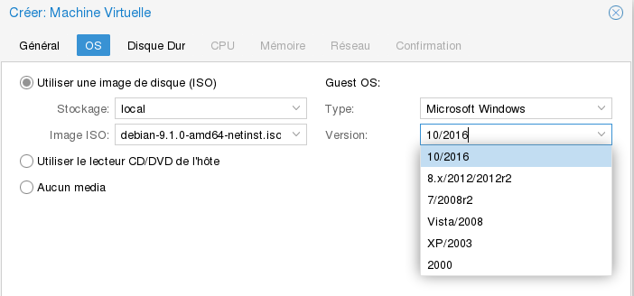

### **Configuration du disque dur.**


Remarque:Comme pour Virtualbox, la place prise réellement sur le disque dur sera la place occupée par la VM, et non la taille choisie du disque.

*J'utilise pour mes serveurs le mode `SATA`, mais il est possible que les résultats soient meilleurs avec d'autres reglages.*

### **Reglage CPU**

On peut choisir le nombre de coeurs du processeur. L'aide indique que l'on peut mettre sans problème plus de coeurs virtuels que de coeurs réels du serveur hote.


### **Mémoire**

On indique la quantité de RAM à allouer à la VM. On peut utiliser une *quantité dynamique* pour les serveurs fonctionnant par intermittence.


### **Réseau**

Il ne reste plus qu'à choisir les caractéristiques du réseau. On prendra le mode bridge, pour que la VM puisse avoir une ip du mme genre que la machine hote.

Il sera également possible de choisir différents modèles de cartes réseau. Pour des VM Windows, il sera préférebale de prendre un modèle du style `Réaltek` qui sera reconnu nativement sans avoir à installer de drivers

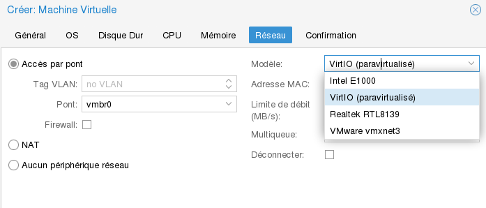

On valide la dernière étape et la Machine Virtuelle est presque prête.

### **Activation de l'affichage**

Lorsque la machine vient tout juste d'être créée, il est indispensable d'avoir un affichage de l'écran. Pour cela, cliquer sur la VM, puis options et activer `Agent Qemu` sur Yes.
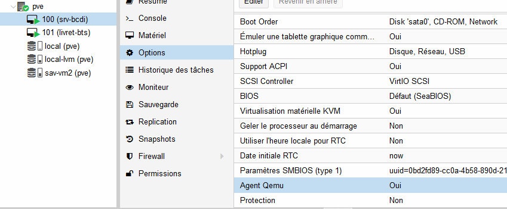

Une fois que tout ceci est prêt, on peut enfin démarrer sa VM. Il suffira d'aller dans l'onglet `Console` pour voir ce qu'indique la VM.


On peut aussi utiliser le mode plein écran pour travailler dans de meilleurs conditions.


## Sauvegarde et restauration de machines virtuelles

L'intérêt premier de la virtualisation c'est d'assimiler un ordinateur à un fichier. Un fichier peut donc être sauvegardé et copié à souhait.
On peut donc fabriquer un instantanné (snapshot) de la VM avant une mise à jour sensible ou autre opération "périlleuse", et la restaurer si cela se passe mal.

**snapshot de la machine**

On se place sur la `VM>snapshots` puis sur `Créer un snapshot`. Il sera aussi utile de décrire l'état de la machine (date, avant mas,etc...)


**Sauvegarde complète**

L'opération sera à peu près identique pour les sauvegardes complètes. On clique sur `sauvegarde` et celle-ci va se faire à chaud.

Pour la restauration, on se placera sur l'espace de stockage dédié aux sauvegardes, puis on cliquera sur la sauvegarde en faisant `restaurer`. 


Après une restauration de machine, on constate qu'il n'est plus possible de faire un snapshot. La machine est par défaut mise au format raw, il devient alors nécéssaire de la convertir au format qcow2.

Ici, on va convertir la machine restaurée

```
qemu-img convert -p -O qcow2 /var/lib/vz/images/200/vm-200-disk-1.raw /var/lib/vz/images/200/vm-200-disk-1.qcow2
```
On doit aussi modifier le fichier de configuration de la machine pour indiquer que le nouveau fichier.qcow2 doit être utilisé.

```
 nano /etc/pve/nodes/pve1/qemu-server/200.conf
```
on remplace "sata0: local:200/vm-200-disk-1.raw,size=550G" par "sata0: local:200/vm-200-disk-1.qcow2,size=550G"

Normalement, la fonctionnalité snapshot devrait être rétablie.

## Ajout d'un disque dur interne dans le serveur à destination d'une VM
(D'après https://pve.proxmox.com/wiki/Physical_disk_to_kvm) Si on ajoute un disque dur sata (sdc) dans le serveur et que l'on souhaite que la partition sdc1 apparaisse dans la VM 103 , alors il suffit de passer en ligne de commande sur le serveur  et de taper:
```
qm set 103 -scsi1 /dev/sdc1
```
On peut choisir -sata0 (avec sata de 0 à 5), -iscsi0 (de 0 à 3) ou -ide0


## Ajout d'un périphérique usb dans une machine virtuelle
On insère le périphérique USB dans le serveur (et non la machine qui accède à l'interface web).
On peut vérifier que le périphérique est bien reconnu en allant sur la console du serveur et en tapant
```
fdisk -l
``` 

(si c'est un espace de stockage) ou alors

```
lsusb
```
Ici la clef USb apparait sous /dev/sdb1

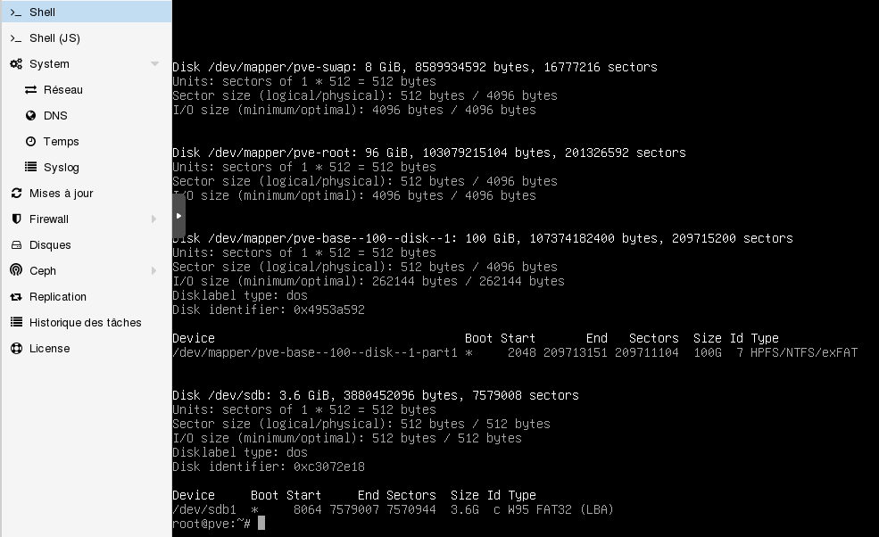

L'ajout de la clef doit se faire VM éteinte. (en tout cas cela ne marche pas chez moi avec VM allumée).
On doit déjà vérifier que le périphérique est bien détecté sr le serveur proxmox.
On se place sur la VM puis `Matériel>Ajouter>USB device`

Il ne reste qu'à choisir le pérphérique USB qu'on ajoute dans la VM.

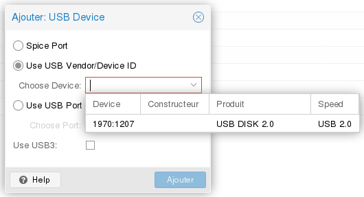

ATTENTION: Le périphérique USB doit apparaitre en noir *(s'il apparait en rouge, c'est qu'il n'est pas prêt)*

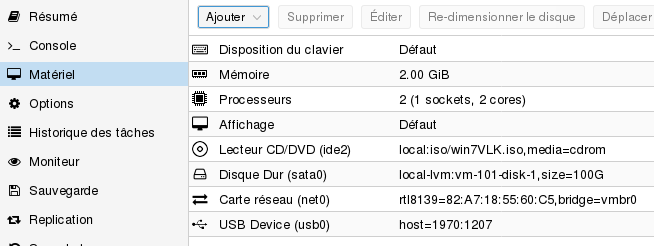

On démarre la VM . Ici , sur une VM Windows, on voit le périphérique détecté.

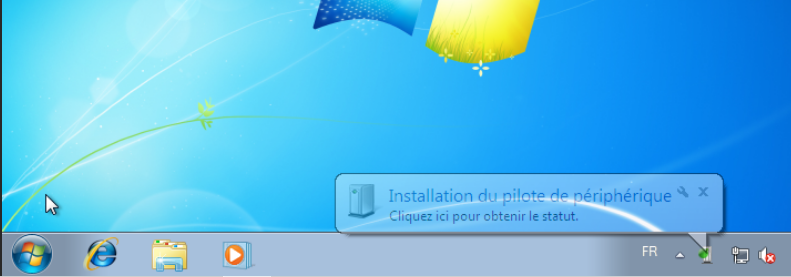

Puis le périphérique prêt à être utilisé


## Créer un compte utilisateur 
Par défaut, seul le compte root local du serveur possède un accès à l'interface de gestion. Il sera utile de créer un ou plusieurs comptes pour qu'un autre utilisateur puisse démarrer les machines virtuelles, ou puisse créer/restaurer des snapshots (Pour le documentaliste si on a virtualisé le serveur bcdi par exemple).

On se place sur `datacenter>Permissions>utilisateur` puis `Ajouter`. On entre les informations demandées.

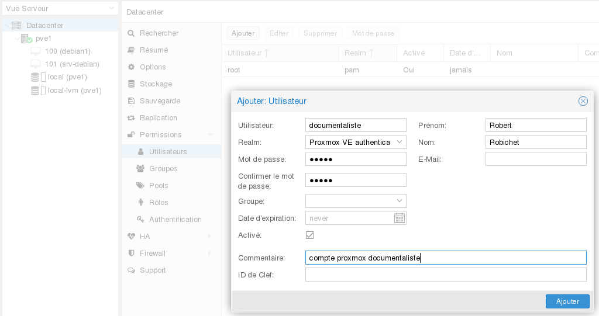

L'utilisateur est ainsi créé mais ne dispose d'aucun droit sur les VMS. Il faut donc lui ajouter des permissions. On peut de la même façon créer des groupes et mettre plusieurs utilisateurs dedans.

On se place sur `datacenter>PVE1>IDdelaVM>Permissions`, puis ajouter `permission d'utilisateur` (On peut aussi ajouter des permissions de groupes si on a mis plusieurs utilisateurs dans un mme groupe, évitant ainsi de faire plusieurs fois la manipulation.
Il ne reste plus qu'à choisir l'utilisateur créé précédement  et de lui attribuer un rôle.
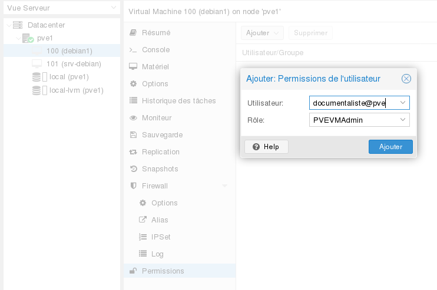

La liste complète des rôles avec les droits associés peut se lire dans `Datacenter>Permissions>roles`


On peut voir ici que l'utilisateur documentaliste ne perçoit que la VM concernée, et a moins de droits que `root`.
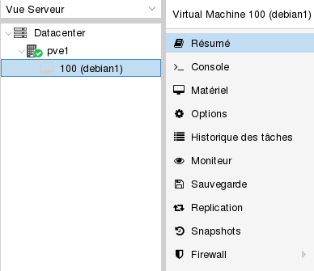

--> Il doit être possible de créer un rôle ayant seulement quelques privilèges comme allumer/éteindre la VM, faire des sauvegardes/snapshots et les restaurer. A voir donc.

## Authentification avec l'annuaire du se3
On peut choisir de connecter le serveur proxmox à l'annuaire du se3. Cela permettra à un utilisateur de gérer une vm particulière ou un groupe de VM.

Pour cela on ira dans
DATACENTER>Authentification puis l'onglet Ajouter>serveur ldap

On entrera les infos nécéssaires.

**realm:** ldap-se3 (enfin ce qu'on veut!)

**BASE Domain Name:** ou=People,ou=lyc-prevert-longjumeau,ou=ac-versailles,ou=education,o=gouv,c=fr (à adapter à votre établissement évidemment. Le Dn se retrouve dans l'interface se3)

**USER ATTRIBUTE:** uid (ainsi la connexion se fera avec le login du se3)

**Server:** ip du se3 (ex 172.20.0.2)

**port:** 389

On valide.


Le serveur est donc relié à l'annuaire du se3. **Pour l'instant aucun compte ne peut se connecter puisqu'il faut indiquer à Proxmox qu'un utilisateur doit être créé.

Pour cela, on reste dans: **DATACENTER>permissions>Ajouter>Utilisateur**

**Utilisateur:** admin (login de l'utilisateur)

**Realm:** On choisir ce qu'on avait ajouté avant (ldap-se3)

**Groupe:** Si vous avez créé un groupe particulier avant (avec des droits comme VMUSER ou VMadmin)

Le reste n'est pas obligatoire.

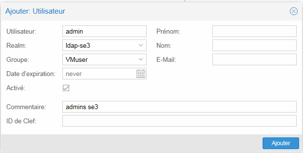

**Il ne reste plus qu'à donner des droits à cet utilisateur pour une VM/groupe de VM.

On clique sur **DATACENTER>IDdelaVM**  puis **Permissions >Ajouter>Permission d'utilisateur>** 

On choisi l'utilisateur créé dans la liste (ex hugov@se3) et on lui indique les droits associés.

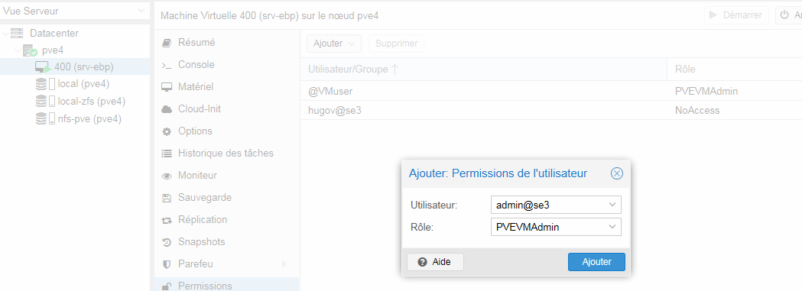

On peut maintenant se connecter avec le compte indiqué et avoir accès aux machines déléguées.

## Migration d'un serveur physique existant vers une VM

Le principe est simple: on va faire une image clonezilla du serveur existant. Il suffira ensuite de créer une VM ayant des caractéristiques identiques et de restaurer l'image clonezilla sur cette VM. 


### **Création de l'image clonezilla**
Pour créer l'image clonezilla sur le serveur physique, on pourra booter avec un livecd sur la dernière version de clonezilla.
La création d'image/restauration est décrite dans l'article suivant.

https://github.com/SambaEdu/se3-docs/blob/master/se3-sauvegarde/clonerse3.md

L'image pourra être stockée sur un disque dur externe, sur un serveur linux avec une connexion ssh, ou sur un partage samba (NAS ou serveur samba). Le plus simple sera d'utiliser un stockage réseau.

Si l'image est sur un disque dur USB, alors il faut impérativement que ce disque soit branché sur le serveur, et soit ajouté à la machine Virtuelle (voir plus haut). Si l'image est sur un partage réseau, alors il n'y a pas de précautions particulières à prendre (si ce n'est mettre la carte réseau en mode bridge).


### **Restauration de l'image clonezilla sur une VM**
On crée la VM avec un disque de capacité au moins identique à celui du serveur physique original. 
On charge dans le cd-rom virtuel l'iso de clonezilla. Au démarrage de la machine, il faut rapidement faire `échap` pour choisir de booter sur le cd-rom virtuel.

On indique après en appuyant sur "2" que l'on souhaite booter sur le cd-rom.

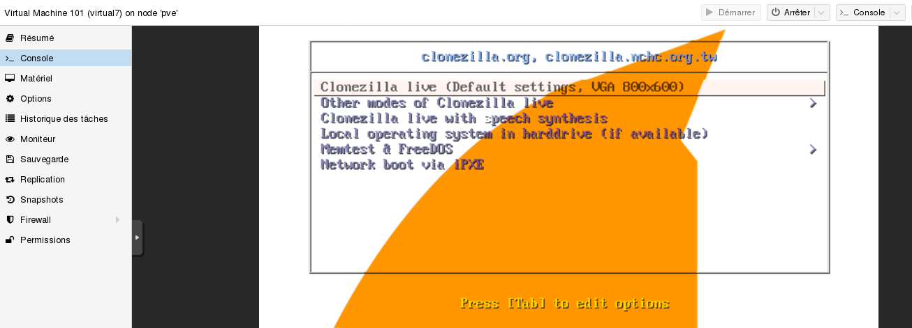


Si l'image est sur un disque dur USB, alors il faut impérativement que ce disque soit branché sur le serveur, et soit ajouté à la machine Virtuelle (voir plus haut). Si l'image est sur un partage réseau, alors il n'y a pas de précautions particulières à prendre (si ce n'est mettre la carte réseau en mode bridge). 
On vérifie que le disque USB est bien reconnu (si on a bien l'image sur un support USB).
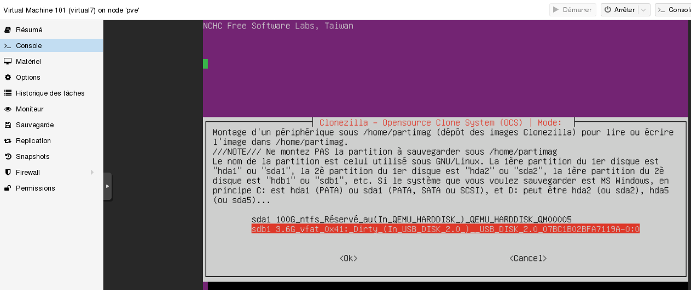

Le reste de l'étape de restauration est toujours dans l'article suivant :
https://github.com/SambaEdu/se3-docs/blob/master/se3-sauvegarde/clonerse3.md


De nombreux périphériques vont être détectés au démarrage, ce qui est normal.Voilà, le serveur physique est maintenant virtualisé.
Il sera judicieux de faire aussitôt une sauvegarde complète, ainsi qu'un snpashot de ce serveur.

### **Problèmes possibles**

**La carte réseau ne semble pas détectée.**

Si la VM est un poste Windows, il faudra changer le modèle de carte et prendre le modèle `Realtek`. Un message d'avertissement indiquera probablement qu'une ip était déjà prise par une ancienne carte réseau et il faudra valider l'utilisation de la nouvelle carte.

Si la VM est sous Linux, il faudra probablement supprimer le fichier `/etc/udev/rules.d/70-persistent-net.rules`.
Ce fichier sera régéneré au redémarrage avec la nouvelle adresse mac et eth0 devrait de nouveau apparaitre.


**Blue screen of death Windows XP**

Il faut vérifier si les périphériques sont bien conformes au poste original (disque IDE, Sata, scsi), si le processeur est bien en 32 bits  avec le bon nombre de processeurs/coeurs (choisir processeur kvm32).

**image non restaurable**

Il faut alors augmenter la capacité du disque virtuel

**Disque dur non détecté**

Si le mode SATA était activé, il faut alors essayé un autre type de connexion (scsi).

**Le disque dur de la VM est en lecture seule**
Après la restauration de l'image clonezilla de mon se3, la partition racine était en lecture seule alors que l'image avait été vérifiée lors de la création. Il faut alors faire une vérification  avec `fsck` des disques.

On forcera la vérification au reboot (avant le montage des disques).
```
shutdown -r -F now
```
Le disque devrait retrouver le mode read/write.

## Mise à niveau de Proxmox
Comme indiqué précédement, il est déconseillé par proxmox (mais plusieurs collègues utilisent en prod le dépot sans le moindre problème) de faire les mises àjour à partir du dépot "pve-no-subscription" car toutes les maj n'ont pas été testées/vérifiées à 100% .
Néanmoins, si promox subit une mise à niveau (passage de la version 5.1 vers la 5.2), alors on peut faire la mise à niveau car les paquets sont présents dans la nouvelle iso (et donc pour les entreprises).

Par sécurité, on éteindra les VMS pour la mise à jour de PVE. Une sauvegarde complete des machines peut aussi être un gage de sécurité.

On ouvre donc le fichier /etc/apt/sources.list.d/pve-enterprise.list
On commente la ligne relative au dépot entreprise et on ajoute le dépot alternatif.
```
#deb https://enterprise.proxmox.com/debian/pve stretch pve-enterprise
deb http://download.proxmox.com/debian/pve stretch pve-no-subscription
```

On lance ensuite une mise à jour de la liste des paquets, puis la mise à jour.
```
pveupdate
pveupgrade
```
Il faudra redémarrer le serveur pour que le changement soit effectif.

Ne pas oublier de modifier le fichier /etc/apt/sources.list.d/pve-enterprise.list et de recommenter la ligne pve-no-subscription
```
#deb https://enterprise.proxmox.com/debian/pve stretch pve-enterprise
#deb http://download.proxmox.com/debian/pve stretch pve-no-subscription
```
puis on actualise la liste des paquets
```
pveupdate
```
